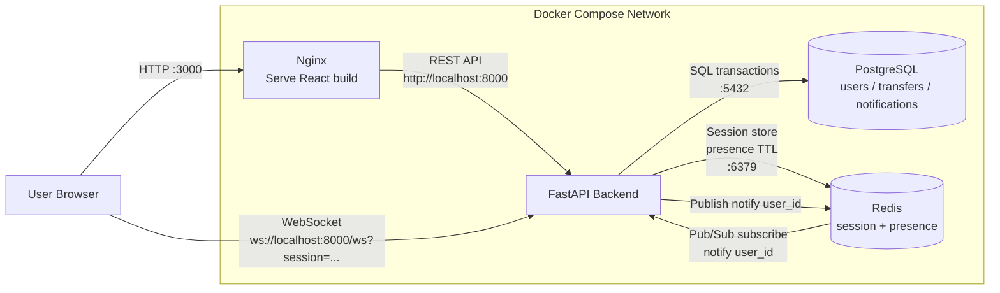

Banking Demo Application – Overview
1. Introduction

This project is a Banking Demo Application designed to demonstrate a modern web architecture using a stateless backend, session management with Redis, relational data storage with PostgreSQL, and real-time notifications via WebSocket.
The application focuses on core banking features rather than UI complexity, making it suitable for:
- technical interviews
- system design discussions
- DevOps / backend / platform engineering training

2. Key Features

- User registration and login
- Session-based authentication (stored in Redis)
- Account balance management
- Money transfer between users
- Real-time transfer notifications using WebSocket
- Designed to run in Docker and easily migrate to Kubernetes

3. High-Level Architecture:
```
+-------------+        HTTP / WebSocket        +------------------+
|   Frontend  |  <--------------------------> |    Backend API   |
|  (React)    |                                |   (FastAPI)      |
+-------------+                                +------------------+
        |                                              |
        |                                              |
        |                     Redis                    |
        |          +--------------------------------+  |
        |          |  Session Store / Cache         |  |
        |          |  (User session, online state)  |  |
        |          +--------------------------------+  |
        |                                              |
        |                 PostgreSQL                   |
        |          +--------------------------------+  |
        |          |  Users, Balances, Transfers     | |
        |          |  Transaction history            | |
        |          +--------------------------------+  |
```



4. Component Breakdown
4.1 Frontend (React)

- Provides UI for login, balance viewing, transfers, and notifications
- Communicates with backend via REST APIs
- Maintains session ID (issued by backend) in browser storage
- Opens a persistent WebSocket connection for real-time notifications

4.2 Backend API (FastAPI)
Implements REST endpoints:

- /login, /register
- /me, /balance
- /transfer
Stateless by design
All authentication state is stored in Redis
Handles WebSocket connections for push notifications

4.3 Redis (Session & Realtime Support)

Redis is used for:

- Storing user sessions (session ID → user mapping)
- Tracking online users
- Supporting real-time notification delivery
- Enabling horizontal scalability (future-ready for Redis Pub/Sub)
- This allows backend pods to remain stateless, which is ideal for scaling in Kubernetes.

4.4 PostgreSQL (Persistent Storage)

PostgreSQL is the system of record for:

- User accounts
- Account balances
- Transfer transactions
- Notification history
All critical financial data is persisted in PostgreSQL to ensure consistency and durability.

5. How to run

- Clone source code
- Run by docker compose:
```
cd banking-demo
docker compose up -d --build
docker compose ps -a
```

6. Check Redis and PostgreSQL

**Docker Compose**

- Redis (container `banking-redis`):
```bash
# Ping
docker exec banking-redis redis-cli ping

# Liệt kê keys (session, presence, ...)
docker exec banking-redis redis-cli keys '*'

# Thông tin server
docker exec banking-redis redis-cli info server
```

**Ý nghĩa kết quả `keys '*'`:**
- **`session:<id>`** — Phiên đăng nhập: mỗi key tương ứng một session (token) mà backend cấp khi user login. Value lưu `user_id`, có TTL (ví dụ 24h). Càng nhiều user đang đăng nhập thì càng nhiều key dạng này.
- **`presence:<user_id>`** — Trạng thái online: user đó đang có WebSocket mở (frontend còn kết nối). Có TTL ngắn (60s), được gia hạn liên tục khi còn online. Key biến mất khi user thoát hoặc ngắt kết nối.

*(Lệnh `keys '*'` liệt kê tất cả key trong DB 0; trên production nên dùng `SCAN` thay vì `keys` nếu số key lớn.)*

- PostgreSQL (container `banking-postgres`, user `banking`, DB `banking`):
```bash
# Kết nối và list bảng
docker exec -it banking-postgres psql -U banking -d banking -c "\dt"

# Kiểm tra kết nối
docker exec banking-postgres psql -U banking -d banking -c "SELECT 1;"

# Xem users (nếu có bảng users)
docker exec banking-postgres psql -U banking -d banking -c "SELECT id, username FROM users LIMIT 5;"
```

**Kubernetes (namespace `banking`, phase1-docker-to-k8s)**

- Redis (pod `redis-0`):
```bash
kubectl exec -it redis-0 -n banking -- redis-cli ping
kubectl exec -it redis-0 -n banking -- redis-cli keys '*'
```

- PostgreSQL (pod `postgres-0`):
```bash
kubectl exec -it postgres-0 -n banking -- psql -U banking -d banking -c "\dt"
kubectl exec -it postgres-0 -n banking -- psql -U banking -d banking -c "SELECT 1;"
```
