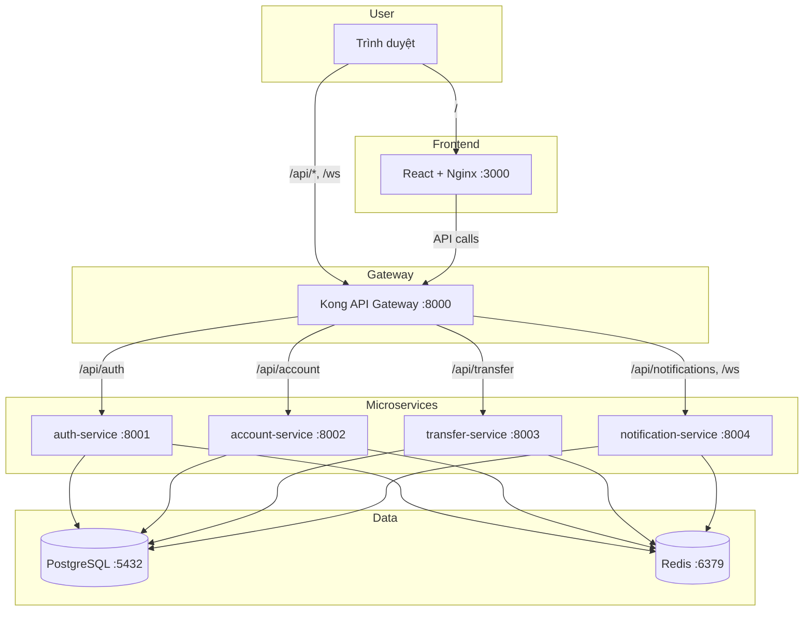

# Banking Demo: Từ Docker Compose đến Kubernetes Production — Giới thiệu tổng quan

> **Series**: Banking Demo — Full DevOps với Microservices  
> **Bài 1/11**: Giới thiệu dự án, kiến trúc và lộ trình

---

## Mở đầu

Nếu bạn đang học DevOps, Kubernetes, hay muốn có một dự án thực tế để demo cho phỏng vấn, bài viết này dành cho bạn.

Trong series này, tôi sẽ chia sẻ hành trình xây dựng **Banking Demo Application** — một ứng dụng banking mini chạy từ Docker Compose, dần nâng cấp lên Kubernetes với Helm, ArgoCD, CI/CD, monitoring, và các chiến lược deploy chuẩn production.

Bài đầu tiên sẽ giới thiệu tổng quan dự án, kiến trúc, tech stack, và lộ trình 6 phase mà chúng ta sẽ đi qua.

---

## Tại sao chọn bài toán Banking?

Banking là domain quen thuộc, dễ hình dung, và chứa đủ các thử thách thực tế:

| Đặc điểm | Ý nghĩa |
|----------|---------|
| **Nhiều service** | Auth, Account, Transfer, Notification — phù hợp để học microservices |
| **State & transaction** | PostgreSQL, Redis — học cách quản lý state trên K8s |
| **Real-time** | WebSocket thông báo chuyển khoản — gần với bài toán thực tế |
| **Phức tạp vừa phải** | Đủ để demo, không quá nặng để học |
| **Dễ trình bày** | Phù hợp cho system design, technical interview |

Ứng dụng tập trung vào các tính năng **core banking** (đăng ký, đăng nhập, số dư, chuyển khoản, thông báo) thay vì giao diện phức tạp — giúp chúng ta tập trung vào phần DevOps và kiến trúc.

---

## Kiến trúc tổng quan

Ứng dụng được thiết kế theo **microservices** với Kong làm API Gateway. Luồng request đi qua Kong và được route đến từng service tương ứng.



### Luồng xử lý chính

- **User** truy cập frontend (React) qua port 3000
- **Frontend** gọi API qua Kong (port 8000): `/api/auth/*`, `/api/account/*`, `/api/transfer/*`, `/api/notifications/*`
- **WebSocket** `/ws` dùng cho thông báo real-time khi có chuyển khoản mới
- **Kong** route request đến đúng service backend
- **PostgreSQL** lưu users, balances, transfers, notifications
- **Redis** lưu session (đăng nhập), presence (online), và Pub/Sub cho thông báo real-time

---

## Tech Stack

| Thành phần | Công nghệ | Ghi chú |
|------------|-----------|---------|
| **Frontend** | React, Tailwind CSS | SPA, serve qua Nginx |
| **Backend** | FastAPI (Python) | 4 microservices |
| **API Gateway** | Kong | Route, CORS, metrics |
| **Database** | PostgreSQL 16 | Stateful data |
| **Cache / Session** | Redis 7 | Session, presence, Pub/Sub |
| **Container** | Docker | Build & run locally |
| **Orchestration** | Kubernetes | Deploy production |
| **Package Manager** | Helm | Template, values |
| **GitOps** | ArgoCD | Sync từ Git |
| **CI/CD** | GitHub Actions | Build & push images |
| **Monitoring** | Prometheus, Grafana | Metrics, dashboards |
| **Logging** | Loki, Promtail | Centralized logs |
| **Tracing** | Tempo, OpenTelemetry | Distributed tracing |

---

## Tính năng chính

- **Đăng ký / Đăng nhập**: Session-based auth, session lưu trong Redis
- **Quản lý số dư**: Xem balance, profile qua Account Service
- **Chuyển khoản**: Chuyển tiền giữa users, ghi nhận transaction
- **Thông báo real-time**: WebSocket push khi có chuyển khoản mới
- **Stateless backend**: Mọi service có thể scale ngang, state nằm ở DB và Redis

---

## Lộ trình 6 Phase

Dự án được tổ chức theo **6 phase** tăng dần độ phức tạp:

| Phase | Nội dung | Bài trong series |
|-------|----------|------------------|
| **—** | Hướng dẫn triển khai Docker Compose | Bài 2 |
| **Phase 1** | Docker Compose → Kubernetes (manifest thuần) | Bài 3 |
| **Phase 2** | Helm Chart + ArgoCD GitOps | Bài 4, 5 |
| **Phase 3** | Monitoring (Prometheus, Grafana, Loki, Tempo, KEDA) | Bài 6 |
| **Phase 4** | CI/CD chuẩn production (GitHub Actions, DB migration) | Bài 7 |
| **Phase 5** | Đổi kiến trúc (tách ns, tách chart, Kong DB) | Bài 9 |
| **Phase 7** | Security & Reliability (JWT, Kong plugins, CI, SLO) | Bài 11 |
| **Phase 6** | Deployment strategies (Blue-Green, Canary) | Bài 10 |

Mỗi phase có folder riêng trong repo, tài liệu rõ ràng, và có thể chạy độc lập hoặc kết hợp.

---

## Chạy thử nhanh (Docker Compose)

Để trải nghiệm ứng dụng ngay trên máy local:

```bash
git clone https://github.com/<your-username>/banking-demo.git
cd banking-demo
docker compose up -d --build
```

Sau khi chạy:

- **Frontend**: http://localhost:3000
- **API (qua Kong)**: http://localhost:8000
- **Kong Admin**: http://localhost:8001

*Chi tiết từng bước, cấu trúc file và xử lý lỗi — xem **Bài 2**.*

---

## Cấu trúc repository

```
banking-demo/
├── backend/              # Backend monolith (phiên bản đầu)
├── frontend/             # React SPA
├── services/             # Microservices (auth, account, transfer, notification)
├── common/               # Shared library (DB, Redis, models, auth)
├── kong/                 # Kong declarative config
├── docker-compose.yml
├── phase1-docker-to-k8s/ # K8s manifests (StatefulSet, Deployment, Ingress)
├── phase2-helm-chart/    # Helm chart + ArgoCD
├── phase3-monitoring-keda/
├── phase4-application-v2/
├── phase5-architecture-refactor/   # Tách ns & chart (Kong, Redis, DB); Kong DB riêng
├── phase6-deployment-strategies/
└── phase7-security-reliability/   # Security & Reliability (JWT, Kong plugins, CI, SLO)
```

---

## Bài tiếp theo trong series

**Bài 2**: *Hướng dẫn triển khai bằng Docker Compose*

- Điều kiện cần, cấu trúc 8 services
- Thứ tự khởi động và dependency
- Chi tiết cấu hình Kong, build context, proxy
- Kiểm tra Redis, PostgreSQL
- Xử lý lỗi thường gặp

---

## Kết luận

Banking Demo là một dự án học tập và demo phù hợp cho ai muốn nắm vững hành trình từ Docker đến Kubernetes production. Series này sẽ đi từng bước qua 6 phase, với code và tài liệu có sẵn trong repository.

Nếu bạn thấy hữu ích, hãy star repo và theo dõi các bài tiếp theo. Mọi đóng góp và thắc mắc đều được chào đón!

**Repo**: [GitHub — banking-demo](https://github.com) *(cập nhật link repo thực tế của bạn)*

---

*Tags: #kubernetes #devops #microservices #docker #helm #argocd #banking*
