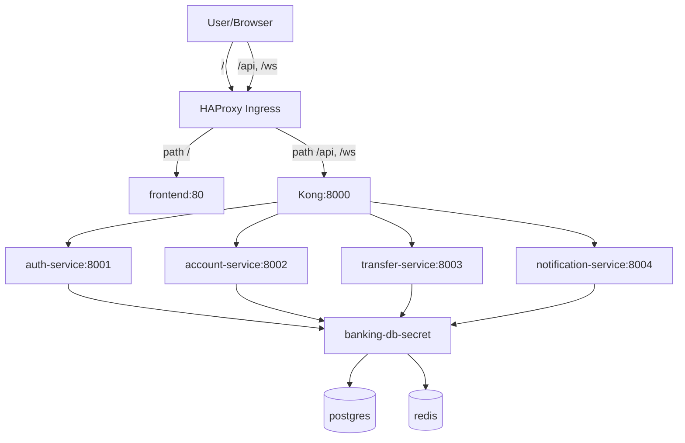

# Banking Demo: Docker Compose → Kubernetes (Phase 1) — Migrate từng bước

> **Series**: Banking Demo — Full DevOps với Microservices  
> **Bài 3/11**: Từ Docker Compose lên Kubernetes bằng manifest thuần

---

## Mở đầu

Ở **bài 2**, chúng ta đã chạy toàn bộ hệ thống bằng Docker Compose trên local. Nhưng khi muốn “production-like” hơn (tự healing, networking chuẩn cluster, scale, rollout…), Kubernetes mới là sân chơi chính.

Trong bài này, mình sẽ hướng dẫn **migrate từ Docker Compose lên Kubernetes** theo đúng cấu trúc repo của bạn (folder `phase1-docker-to-k8s/`) bằng **manifest YAML thuần** (chưa dùng Helm).

Mục tiêu của Phase 1:

- **Postgres + Redis** chạy bằng **StatefulSet** (có volume/PVC).
- **Kong** làm API Gateway (Deployment + ConfigMap).
- **4 microservices + frontend** chạy bằng Deployment + Service.
- **Ingress (HAProxy Ingress)** route theo path: `/` → frontend, `/api` & `/ws` → Kong.

---

## Kiến trúc trên Kubernetes (Phase 1)



---

## Mapping: Docker Compose → Kubernetes

Đây là cách “dịch” tư duy từ Compose sang K8s:

| Trong Docker Compose | Trên Kubernetes | File Phase 1 |
|---|---|---|
| `postgres` + volume | **StatefulSet** + PVC + Headless Service | `postgres.yaml` |
| `redis` + volume | **StatefulSet** + PVC + Headless Service | `redis.yaml` |
| `kong` + mount `kong.yml` | **Deployment** + **ConfigMap** | `kong.yaml`, `kong-configmap.yaml` |
| `auth/account/transfer/notification` | Deployment + Service | `*-service.yaml` |
| `frontend` + port 3000 | Deployment + Service + Ingress route `/` | `frontend.yaml`, `ingress.yaml` |
| `.env` / environment | **Secret** + envFrom/secretKeyRef | `secret.yaml` |
| Port mapping `3000:80` | Ingress / Service (ClusterIP) | `ingress.yaml` |

Điểm “khác cảm giác” nhất: trên K8s, bạn thường **không expose từng container ra host**. Bạn expose **Ingress** (hoặc LoadBalancer) và route nội bộ bằng Service DNS.

---

## Điều kiện cần trước khi apply

### 1) Cluster đã có Ingress Controller (HAProxy)

Manifest Phase 1 dùng:

- `ingressClassName: haproxy`
- host ví dụ: `npd-banking.co`

Nếu bạn dùng NGINX Ingress hoặc khác, bạn cần chỉnh `ingressClassName` và/hoặc annotation tương ứng.

### 2) Có StorageClass `nfs-client` (khuyến nghị)

`postgres.yaml` và `redis.yaml` dùng:

- `storageClassName: nfs-client`

Nếu cluster bạn không có `nfs-client`, bạn cần:

- Tạo StorageClass tương ứng, hoặc
- Đổi `storageClassName` sang StorageClass có sẵn trong cluster.

### 3) ImagePullSecrets (tuỳ cluster)

Trong Phase 1:

- Postgres/Redis/Kong pull từ Docker Hub (có thể gặp rate limit) → manifest có `imagePullSecrets: dockerhub-registry`.
- App images pull từ GitLab Registry → manifest microservices dùng `imagePullSecrets: gitlab-registry`.

Bạn cần tạo các secret này trong namespace `banking` (chỉ khi cluster yêu cầu auth).

---

## Thứ tự triển khai (quan trọng)

Trong `phase1-docker-to-k8s/PHASE1.md` đã có thứ tự chuẩn. Mình diễn giải lại theo dependency:

1. **Namespace + Secret** (để mọi thứ còn lại có chỗ deploy + có env)
2. **Postgres + Redis** (data layer phải sẵn sàng trước)
3. **Kong ConfigMap → Kong Deployment/Service**
4. **4 microservices + frontend**
5. **Ingress** (route traffic vào hệ thống)

---

## Triển khai từng bước

### Bước 1: Tạo namespace và secret

```bash
cd phase1-docker-to-k8s
kubectl apply -f namespace.yaml
kubectl apply -f secret.yaml
```

`secret.yaml` tạo secret `banking-db-secret` chứa:

- `DATABASE_URL`: trỏ về service DNS `postgres:5432`
- `REDIS_URL`: trỏ về service DNS `redis:6379`

Tư duy quan trọng: trên K8s, **host không phải localhost**; host là **tên Service**.

### Bước 2: Deploy Postgres + Redis (StatefulSet)

```bash
kubectl apply -f postgres.yaml
kubectl apply -f redis.yaml

kubectl -n banking rollout status statefulset/postgres
kubectl -n banking rollout status statefulset/redis
```

Vì sao dùng StatefulSet?

- Pod có “identity” cố định: `postgres-0`, `redis-0`
- PVC gắn theo pod: `pgdata-postgres-0`, `redis-data-redis-0`
- Phù hợp cho workload có state

### Bước 3: Deploy Kong (ConfigMap → Deployment/Service)

```bash
kubectl apply -f kong-configmap.yaml
kubectl apply -f kong.yaml
kubectl apply -f kong-service.yaml
```

Trong Phase 1, Kong chạy **declarative config** (không cần DB riêng). Cấu hình route nằm trong ConfigMap `kong-config`, key `kong.yml`.

### Bước 4: Deploy microservices + frontend

```bash
kubectl apply -f auth-service.yaml
kubectl apply -f account-service.yaml
kubectl apply -f transfer-service.yaml
kubectl apply -f notification-service.yaml
kubectl apply -f frontend.yaml
```

### Bước 5: Deploy Ingress

```bash
kubectl apply -f ingress.yaml
```

Ingress Phase 1 route:

- `/` → service `frontend:80`
- `/api` → service `kong:8000`
- `/ws` → service `kong:8000`

---

## Verify sau khi deploy

### 1) Kiểm tra pods/service/ingress

```bash
kubectl get pods -n banking
kubectl get svc -n banking
kubectl get ingress -n banking
```

Bạn cần thấy:

- `postgres-0`, `redis-0` Running/Ready
- `kong-...`, `auth-service-...`, `account-service-...`, `transfer-service-...`, `notification-service-...`, `frontend-...` Ready

### 2) Kiểm tra health endpoint nội bộ

Nếu bạn muốn test nhanh trong cluster:

```bash
kubectl -n banking port-forward svc/kong 8000:8000
curl http://localhost:8000/api/auth/health
curl http://localhost:8000/api/account/health
curl http://localhost:8000/api/transfer/health
curl http://localhost:8000/api/notifications/health
```

### 3) Truy cập từ bên ngoài qua Ingress

Tuỳ cluster, bạn sẽ có:

- DNS/host trỏ tới Ingress, hoặc
- IP của LoadBalancer/NodePort

Trong manifest có host ví dụ `npd-banking.co`. Nếu bạn chạy local/minikube/kind thì thường cần chỉnh host hoặc dùng `/etc/hosts`.

---

## Giải thích nhanh các “mảnh ghép” quan trọng

### 1) Secret: cấu hình kết nối đúng “địa chỉ K8s”

`DATABASE_URL` và `REDIS_URL` trong secret trỏ về:

- `postgres:5432` (Service DNS)
- `redis:6379` (Service DNS)

Đây là điểm hay bị sai nếu bạn quen Docker Compose (tuy Compose cũng dùng service name, nhưng nhiều bạn lại hardcode localhost).

### 2) Headless Service cho StatefulSet

Postgres/Redis dùng `clusterIP: None` để tạo headless service → pod có DNS ổn định.

### 3) Kong config: strip_path và route WebSocket

Kong routes kiểu:

- `/api/auth` → upstream `/register`, `/login` (vì `strip_path: true`)
- `/ws` route về notification-service và bật `protocols: http/https` để hỗ trợ WebSocket qua Ingress.

### 4) ReadinessProbe giúp rollout “đúng nhịp”

Manifest có readiness probe cho:

- Postgres: `pg_isready`
- Redis: `redis-cli ping`
- Kong: `kong health`
- Các service: `/health`

Readiness giúp Service chỉ route traffic tới pod “Ready”.

---

## Debug nhanh các lỗi hay gặp

### 1) `ImagePullBackOff` / rate limit Docker Hub

Triệu chứng: Postgres/Redis/Kong không pull được image.

Cách xử lý:

- Tạo secret `dockerhub-registry` (docker-registry type) trong namespace `banking`
- Hoặc mirror image vào registry riêng

### 2) App pods crash do không pull được image GitLab Registry

Triệu chứng: `ErrImagePull` ở các pod auth/account/transfer/notification/frontend.

Cách xử lý:

- Tạo secret `gitlab-registry` trong namespace `banking`
- Hoặc đổi image sang registry khác mà cluster pull được

### 3) PVC pending (không có StorageClass)

Triệu chứng: `postgres-0`/`redis-0` Pending.

Kiểm tra:

```bash
kubectl get pvc -n banking
kubectl describe pvc <pvc-name> -n banking
```

Sửa:

- Tạo/đổi `storageClassName` cho phù hợp cluster.

### 4) Ingress không route được

Triệu chứng: vào host không ra frontend, hoặc API 404.

Checklist:

- Cluster có HAProxy Ingress Controller chưa?
- `ingressClassName` đúng chưa?
- Host bạn truy cập có match `npd-banking.co` không?

---

## Tóm tắt

Sau bài này, bạn đã có bản chạy trên Kubernetes với:

- StatefulSet cho Postgres/Redis (có PVC)
- Kong làm gateway
- 4 microservices + frontend
- Ingress route `/` và `/api`, `/ws`

Đây là bước đệm hoàn hảo để sang **Phase 2 (Helm + GitOps)**, nơi chúng ta biến đống YAML này thành chart có values, templates, và deploy bằng ArgoCD.

---

## Bài tiếp theo

**Bài 4**: *Helm Chart Bootstrap — gom manifest thành 1 chart “umbrella”*

- Vì sao chọn “bootstrap style” (templates chung, values theo service)
- Cách parameter hóa ports/probes/resources/env
- Install/upgrade và bật/tắt component theo `enabled`

---

*Tags: #kubernetes #k8s #ingress #kong #statefulset #devops*

