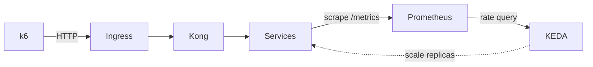

# Banking Demo — Phase 3: Monitoring và Auto Scale — Prometheus, Grafana, KEDA

> **Series**: Banking Demo — Full DevOps với Microservices  
> **Bài 6/11**: Monitoring và Auto Scale — Phase 3

---

## Mở đầu

Ở **bài 4, 5**, chúng ta đã có Helm chart và ArgoCD: Banking Demo chạy trên Kubernetes, cấu hình trong Git, sync là deploy. Tiếp theo cần **quan sát** hệ thống (metric, log, trace) và **tự động scale** khi tải tăng.

**Phase 3** bổ sung **monitoring** (Prometheus, Grafana, Loki, Tempo) và **auto scale** (KEDA): thu thập metric từ các service, hiển thị dashboard, scale Deployment theo RPS (rate `http_requests_total`) thay vì chỉ CPU. Bài này mô tả luồng Phase 3: cài monitoring stack bằng Helm, cài KEDA và ScaledObject, load test để kiểm chứng scale.

---

## Luồng tổng quan

```
Request (k6) → Ingress → Kong → Services
Services → /metrics → Prometheus (scrape)
Prometheus → KEDA (query rate) → scale replicas
Log: Pods → Promtail → Loki
Trace: App → OTEL Collector → Tempo
Grafana: query Prometheus, Loki, Tempo
```

| Thành phần | Vai trò |
|------------|---------|
| **Prometheus** | Thu thập metric (scrape `/metrics` từ services, Kong, exporters). |
| **Grafana** | Dashboard, query Prometheus / Loki / Tempo. |
| **Loki** | Lưu log (Promtail gửi log pod → Loki). |
| **Promtail** | Đọc log pod, gửi Loki. |
| **Tempo** | Lưu trace (OTEL Collector nhận OTLP từ app → Tempo). |
| **KEDA** | Scale Deployment theo Prometheus metric (vd: RPS). |

---

## Lý thuyết nền: Observability — Metrics, Logs, Traces

**Observability** (khả năng quan sát) thường được mô tả bằng **3 trụ cột**:

| Trụ cột | Mô tả | Trong Phase 3 |
|---------|--------|----------------|
| **Metrics** | Số đo theo thời gian (RPS, latency, CPU, memory). Trả lời "hệ thống chạy thế nào?". | Prometheus scrape `/metrics` → Grafana dashboard. |
| **Logs** | Sự kiện dạng text (log ứng dụng, log pod). Trả lời "chuyện gì đã xảy ra?". | Promtail thu log pod → Loki; Grafana query Loki. |
| **Traces** | Đường đi request qua nhiều service (span, trace ID). Trả lời "request đi đâu, mất thời gian ở đâu?". | App gửi OTLP → OTEL Collector → Tempo; Grafana query Tempo. |

Cả ba bổ sung cho nhau: metric cho biết "auth-service P95 tăng", log cho biết "lỗi connection refused", trace cho biết "request dừng lâu ở transfer-service". Phase 3 triển khai đủ ba trụ để vừa theo dõi hiệu năng vừa debug khi sự cố.

---

## Cấu trúc Phase 3 trong repo

```
phase3-monitoring-keda/
├── PHASE3.md                 # Tổng quan Phase 3
├── PHASE3-FLOW.md            # Sơ đồ luồng (Mermaid)
├── helm-monitoring/          # Monitoring + Logging + Tracing (Helm)
│   ├── README.md
│   ├── values-kube-prometheus-stack.yaml   # Prometheus + Grafana
│   ├── values-loki.yaml
│   ├── values-promtail.yaml
│   ├── values-tempo.yaml
│   └── values-otel-collector.yaml
├── keda/                     # KEDA + ScaledObjects
│   ├── README.md
│   ├── scaledobject-auth.yaml
│   ├── scaledobject-account.yaml
│   ├── scaledobject-transfer.yaml
│   └── scaledobject-notification.yaml
├── hpa/                      # (Tùy chọn) HPA theo CPU/Memory
└── load-test/                # k6 scripts + run-scenarios.sh
```

---

## Monitoring stack — Helm

Phase 3 triển khai monitoring bằng **Helm**: pull chart, sửa values, `helm install/upgrade`. Thứ tự cài (namespace `monitoring`):

1. **Kube Prometheus Stack** — Prometheus + Grafana + Alertmanager.
2. **Loki** — backend log.
3. **Promtail** — ship log pod → Loki.
4. **Tempo** — backend trace.
5. **OpenTelemetry Collector** — nhận OTLP từ app → export Tempo.

### Thêm repo và cài

```bash
helm repo add prometheus-community https://prometheus-community.github.io/helm-charts
helm repo add grafana https://grafana.github.io/helm-charts
helm repo add open-telemetry https://open-telemetry.github.io/opentelemetry-helm-charts
helm repo update

kubectl create namespace monitoring

helm upgrade --install kube-prometheus-stack prometheus-community/kube-prometheus-stack \
  -n monitoring -f phase3-monitoring-keda/helm-monitoring/values-kube-prometheus-stack.yaml

helm upgrade --install loki grafana/loki -n monitoring \
  -f phase3-monitoring-keda/helm-monitoring/values-loki.yaml
helm upgrade --install promtail grafana/promtail -n monitoring \
  -f phase3-monitoring-keda/helm-monitoring/values-promtail.yaml

helm upgrade --install tempo grafana/tempo -n monitoring \
  -f phase3-monitoring-keda/helm-monitoring/values-tempo.yaml
helm upgrade --install otel-collector open-telemetry/opentelemetry-collector -n monitoring \
  -f phase3-monitoring-keda/helm-monitoring/values-otel-collector.yaml
```

Chi tiết từng chart (scrape config cho banking services, Kong, Redis/Postgres exporters, datasource Grafana) xem `phase3-monitoring-keda/helm-monitoring/README.md`.

---

## Metrics — Prometheus scrape banking services

Các service (auth, account, transfer, notification) cần **expose `/metrics`** (Prometheus format). Trong values **kube-prometheus-stack** có `additionalScrapeConfigs` trỏ tới từng service trong namespace `banking` (vd: `auth-service.banking.svc.cluster.local:8001/metrics`). Kong có thể bật Prometheus plugin và scrape qua `kong.banking.svc.cluster.local:8001/metrics`. Redis và PostgreSQL thu qua **exporters** (xem `phase3-monitoring-keda/exporters/`).

Metric quan trọng cho KEDA: **`http_requests_total`** — số request theo job/label. KEDA dùng **rate** (vd: `sum(rate(http_requests_total{job="auth-service"}[2m]))`) làm giá trị để so sánh với ngưỡng scale.

---

## Latency và percentiles (P50, P95, P99)

Khi đánh giá hiệu năng API, **average (trung bình)** dễ bị kéo lên bởi vài request rất chậm (vd timeout 30s). **Percentile** ổn định hơn: **P95 = 200ms** nghĩa là 95% request có thời gian phản hồi ≤ 200ms, 5% chậm hơn.

| Percentile | Ý nghĩa | Khi nào dùng |
|------------|---------|---------------|
| **P50 (median)** | 50% request ≤ X ms | Trải nghiệm "điển hình" của user. |
| **P95** | 95% request ≤ X ms | **SLA, mục tiêu hiệu năng** — phổ biến nhất. |
| **P99** | 99% request ≤ X ms | Theo dõi trải nghiệm tệ nhất của ~1% request. |

**Trong Phase 3:**

- **Grafana**: Panel "P95 Latency by Service" dùng PromQL kiểu `histogram_quantile(0.95, sum(rate(http_request_duration_seconds_bucket[5m])) by (job, le))`.
- **k6**: Script đặt threshold ví dụ `http_req_duration: ['p(95)<3000']` — 95% request phải &lt; 3s; vượt thì k6 báo lỗi.

Chi tiết (ví dụ minh họa, khi nào chọn P95 vs P99) xem `phase3-monitoring-keda/METRICS-PERCENTILES.md`.

---

## Auto scale — KEDA

**KEDA** (Kubernetes Event-driven Autoscaler) scale Deployment theo **metric bên ngoài** (vd Prometheus), không chỉ CPU/Memory. Banking Demo dùng **Prometheus scaler**: query RPS từ Prometheus, nếu RPS > threshold thì tăng replica, nếu RPS < activationThreshold (và đủ điều kiện) thì giảm.

### Cài KEDA

```bash
helm repo add kedacore https://kedacore.github.io/charts
helm repo update
kubectl create namespace keda
helm upgrade --install keda kedacore/keda -n keda
```

### ScaledObject (ví dụ auth-service)

```yaml
apiVersion: keda.sh/v1alpha1
kind: ScaledObject
metadata:
  name: auth-service-scaler
  namespace: banking
spec:
  scaleTargetRef:
    name: auth-service
  minReplicaCount: 1
  maxReplicaCount: 5
  cooldownPeriod: 120
  triggers:
    - type: prometheus
      metadata:
        serverAddress: http://kube-prometheus-stack-prometheus.monitoring.svc.cluster.local:9090
        query: sum(rate(http_requests_total{job="auth-service"}[2m]))
        threshold: "5"
        activationThreshold: "1"
```

- **query**: RPS trung bình 2 phút cho `auth-service`.
- **threshold**: Scale up khi RPS > 5.
- **activationThreshold**: Scale down khi RPS < 1 (minReplicaCount vẫn được tôn trọng).
- **minReplicaCount / maxReplicaCount**: 1 và 5; có thể chỉnh trong từng file.

Apply ScaledObjects:

```bash
kubectl apply -f phase3-monitoring-keda/keda/scaledobject-auth.yaml
kubectl apply -f phase3-monitoring-keda/keda/scaledobject-account.yaml
kubectl apply -f phase3-monitoring-keda/keda/scaledobject-transfer.yaml
kubectl apply -f phase3-monitoring-keda/keda/scaledobject-notification.yaml
```

### KEDA vs HPA — khi nào dùng gì?

| Tiêu chí | **HPA** (Horizontal Pod Autoscaler) | **KEDA** |
|----------|-------------------------------------|----------|
| **Metric** | CPU, Memory (built-in K8s) hoặc custom metric qua metrics-server. | Metric **bên ngoài**: Prometheus, queue (RabbitMQ, Kafka), HTTP, … |
| **Use case** | "Scale khi CPU > 70%" — đơn giản, không cần Prometheus. | "Scale khi RPS > 5" hoặc "scale khi queue length > 10" — linh hoạt theo nghiệp vụ. |
| **Banking Demo** | Có sẵn trong `phase3-monitoring-keda/hpa/` nếu muốn scale theo CPU/Memory. | Phase 3 chọn **KEDA** vì muốn scale theo **RPS** (rate `http_requests_total`) — phản ánh tải thực tế hơn CPU khi service nhẹ. |

**Lưu ý:** Không dùng cả KEDA và HPA cho **cùng một** Deployment; chọn một trong hai. Nếu muốn scale theo CPU/Memory thuần, dùng `phase3-monitoring-keda/hpa/` thay vì KEDA.

---

## Luồng KEDA + load test



1. **Prometheus** scrape `http_requests_total` từ từng service.
2. **KEDA** định kỳ query (vd: `sum(rate(http_requests_total{job="auth-service"}[2m]))`).
3. Nếu giá trị > **threshold** → tăng replica (tới maxReplicaCount).
4. Nếu giá trị < **activationThreshold** (và qua cooldown) → giảm replica (tới minReplicaCount).
5. **Load test** (k6) gửi nhiều request tới `/api/auth`, `/api/account`, `/api/transfer` → RPS tăng → KEDA scale up. Dừng k6 → RPS giảm → sau cooldown scale down.

---

## Load test — k6

Trong repo có script k6 và `run-scenarios.sh`:

- `load-test/k6-auth.js` — load `/api/auth` (login).
- `load-test/k6-account.js` — load `/api/account` (me, balance).
- `load-test/k6-transfer.js` — load `/api/transfer`.

Chạy (sau khi đã cài monitoring + KEDA, ScaledObjects đã apply):

```bash
cd phase3-monitoring-keda/load-test
./run-scenarios.sh
```

Trong lúc chạy: `kubectl get pods -n banking -w` và `kubectl get hpa -n banking` — replicas tăng khi RPS vượt threshold. Dừng k6, đợi vài phút — replicas giảm dần. Chi tiết biến môi trường (BASE_URL, VUs, duration) xem `load-test/README.md`.

---

## Kiểm chứng

| Bước | Kiểm tra |
|------|----------|
| Trước load test | `kubectl get pods -n banking` — mỗi deployment 1 replica. |
| Trong load test | `kubectl get pods -n banking`, `kubectl get hpa -n banking` — replicas tăng (tới max). |
| Sau khi dừng k6 | Đợi cooldown — replicas giảm về min. |
| ScaledObject | `kubectl get scaledobject -n banking`, `kubectl describe scaledobject <name> -n banking`. |

---

## Tóm tắt

- **Phase 3** thêm **monitoring** (Prometheus, Grafana, Loki, Promtail, Tempo, OTEL Collector) và **auto scale** (KEDA).
- Monitoring cài bằng **Helm** vào namespace `monitoring`; scrape banking services, Kong, exporters; Grafana query Prometheus, Loki, Tempo.
- **KEDA** scale 4 Deployment (auth, account, transfer, notification) theo **Prometheus** (rate `http_requests_total`); cấu hình qua ScaledObject (threshold, min/max replicas, cooldown).
- **Load test** (k6) dùng để kiểm chứng: RPS tăng → scale up; dừng tải → scale down.

Bài tiếp theo sẽ đi vào **CI/CD** (Phase 4): GitHub Actions build image, push registry, cập nhật Helm values và ArgoCD sync.

---

## Bài tiếp theo

**Bài 7**: *CI/CD — Build image và cập nhật deploy*

- Pipeline build từng service, push image lên registry
- Cập nhật image tag trong values, ArgoCD sync
- Tích hợp với GitOps (Phase 4)

---

*Tags: #monitoring #prometheus #grafana #keda #autoscale #kubernetes #devops #phase3*
