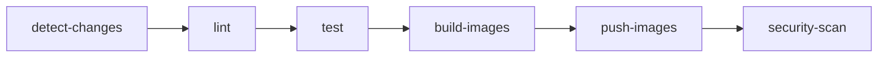
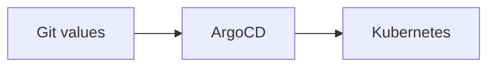

# Banking Demo: CI/CD — Build image và cập nhật deploy

> **Series**: Banking Demo — Full DevOps với Microservices  
> **Bài 7/11**: CI/CD — Build image và cập nhật deploy

---

## Mở đầu

Ở **bài 5** chúng ta đã deploy Banking Demo bằng ArgoCD (Git làm nguồn chân lý), ở **bài 6** đã có monitoring và KEDA. Mỗi lần sửa code (auth-service, account-service, frontend…), nếu vẫn **build image tay**, push registry, rồi **sửa image tag trong values** và sync ArgoCD tay thì dễ sót và tốn thời gian. **CI/CD** tự động hóa: push code → CI chạy lint, test, build, push image; sau đó cập nhật values và ArgoCD sync (hoặc auto-sync) để rollout.

Bài này trình bày theo thứ tự: **(1) định hướng nâng cấp application (Phase 4)** để rõ ta đang build gì và tại sao cần CI/CD; **(2) CI/CD trong Banking Demo dùng như thế nào**; **(3) GitHub Actions có những step nào**; **(4) CD với ArgoCD**; **(5) thực hành** từ push code đến deploy.

---

## 1. Định hướng nâng cấp application (Phase 4)

Trước khi bật CI/CD, cần xác định **application layer** ta đang nâng cấp là gì — từ đó mới biết CI phải build những service nào và CD rollout cái gì.

### Application v2 so với bản gốc (v1)

Phase 4 nâng cấp **application** (v2) so với bản gốc (v1), vẫn chạy trên cùng Helm chart và ArgoCD (Phase 2):

| Hạng mục | Bản gốc (v1) | Phase 4 (v2) |
|----------|--------------|--------------|
| **Đăng ký** | `{username, password}` | `{phone, username, password}` — validate phone, sinh **số tài khoản 12 chữ số** unique, trả về `account_number`. |
| **Đăng nhập** | Chỉ `username` + password | Hỗ trợ **phone** hoặc **username** (backward compatible). |
| **Chuyển tiền** | (theo user id / username) | Chuyển theo **số tài khoản** (`to_account_number`), API **lookup** tên người nhận. |
| **UI** | React cơ bản | Form rõ ràng hơn, hiển thị account number, tên người nhận khi chuyển. |
| **Logging** | Log thường | **Structured logging** (JSON), middleware log request/response, event `register_success/failed`, `login_success/failed` — phù hợp Phase 3 (Loki, Grafana). |
| **Validation & HTTP** | Cơ bản | Chuẩn hóa 400/409/401, validate length, phone digits; dễ debug. |
| **Sau deploy** | Kiểm tra tay | **Smoke test** (Helm Job) chạy health + login qua Kong, log `✅ Smoke tests passed`. |

Code v2 nằm trong **`phase4-application-v2/`** (common, services, frontend); CI build từ đây và push image; Helm values (Phase 2) trỏ image tag tới SHA/tag do CI tạo.

### Tại sao cần CI/CD khi đã có v2?

- **Nhiều service** (auth, account, transfer, notification, frontend): mỗi lần sửa code phải build đúng service, push đúng registry, cập nhật đúng values — làm tay dễ nhầm.
- **Thay đổi thường xuyên** (tính năng mới, sửa lỗi, thêm log): cần **pipeline cố định** (lint → test → build → push) để chất lượng đồng nhất và deploy nhanh.
- **Git làm nguồn chân lý** (bài 5): deploy qua Git (values + tag); CI chỉ cần build và push image, con người (hoặc script) cập nhật tag trong values rồi ArgoCD sync hoặc auto-sync.

Vì vậy bước tiếp theo là: **dùng CI/CD như thế nào** (luồng tổng thể), rồi **GitHub Actions có những step nào** (chi tiết).

---

## 2. CI/CD trong Banking Demo — dùng như thế nào

Luồng tổng thể:

```
Code push/PR  →  CI (GitHub Actions)  →  Push images  →  Cập nhật values trong Git  →  CD (ArgoCD sync)
```

| Giai đoạn | Công cụ | Việc làm |
|-----------|---------|-----------|
| **CI** | GitHub Actions | Lint → Test → Build Docker image (chỉ service thay đổi) → Push lên GitLab Container Registry. |
| **CD** | ArgoCD | Đọc Helm values từ Git (đã cập nhật `image.tag`) → Render Helm → Apply lên Kubernetes (rollout 5 service). |

Trong Banking Demo:

- **CI không tự động sửa Git**: bước "cập nhật `image.tag` trong 5 file values" do người (hoặc script riêng) thực hiện, rồi commit + push. Cách này đơn giản, kiểm soát được và đúng tinh thần GitOps.
- **CD**: ArgoCD có thể **sync tay** (bấm Sync sau khi push values) hoặc **auto-sync định kỳ** (vd 5 phút/lần) để tự rollout khi thấy values thay đổi trên Git.

Như vậy: **định hướng app (v2)** → **CI/CD dùng như thế này**; phần dưới đi vào **GitHub Actions có những step nào** và **ArgoCD cấu hình ra sao**.

---

## 3. GitHub Actions — các bước (steps) cụ thể

CI được định nghĩa trong **`.github/workflows/ci.yml`**, gồm các **job** chạy theo thứ tự. Mỗi job gồm nhiều **step** (bước).

### 3.1. Khi nào CI chạy (trigger)

| Event | Điều kiện |
|-------|-----------|
| **Push** | Branch `main`, `develop` — và chỉ khi có thay đổi trong đường dẫn (path) liên quan code app. |
| **Pull Request** | Branch `main` — cùng bộ path. |
| **Chạy tay (manual)** | `workflow_dispatch` — chọn service cần build, có thể bỏ test, force push. |

**Path filters** — CI **chỉ chạy** khi có thay đổi trong:

- `common/**`, `services/**`, `frontend/**`
- `phase4-application-v2/**`
- `.github/workflows/ci.yml`

**Không** trigger khi chỉ đổi: `phase2-helm-chart/**`, `phase3-monitoring-keda/**`, `k8s/**`, `*.md`. Sửa Helm values hoặc tài liệu sẽ không gây build lại app.

### 3.2. Các job (và step) theo thứ tự



| Job | Mục đích | Step chính (tóm tắt) |
|-----|----------|------------------------|
| **detect-changes** | Xác định service nào thay đổi | Checkout repo → paths-filter (theo từng service + common) → Build danh sách service cần build (output `services-list`). Nếu `common` đổi → build **all**. |
| **lint** | Kiểm tra code | Checkout → Setup Python → `ruff check` cho `common`, `services`, `phase4-application-v2`. |
| **test** | Chạy test | Checkout → Setup Python → Install deps → `python -m compileall` → `pytest` (phase4-application-v2/tests). Có thể tắt qua input khi chạy tay (`skip_tests`). |
| **build-images** | Build Docker image | Với **matrix** (auth, account, transfer, notification, frontend): nếu service nằm trong `services-list` thì checkout → Docker Buildx → metadata (tags) → build image → upload artifact (tar). Service không đổi thì skip. |
| **push-images** | Push lên registry | Chỉ chạy khi push `main`/`develop` (hoặc manual + force_push). Với từng service: download artifact → load image → login GitLab Registry → tag (SHA, branch, latest) → push. |
| **security-scan** | Quét bảo mật image | Trivy scan image (HIGH, CRITICAL), `continue-on-error: true` để không chặn pipeline. |

**Build có chọn lọc:**

- Đổi `phase4-application-v2/services/auth-service/**` → chỉ build **auth-service**.
- Đổi `phase4-application-v2/common/**` → build **tất cả** (common dùng chung).
- Đổi `phase4-application-v2/frontend/**` → chỉ build **frontend**.

### 3.3. Chạy tay (workflow_dispatch)

Trong GitHub: **Actions** → chọn workflow **CI** → **Run workflow**.

| Input | Ý nghĩa |
|-------|---------|
| **services** | `all` hoặc chọn từng service / tổ hợp (vd: auth-service, frontend). |
| **skip_tests** | Bỏ qua job test (hotfix nhanh). |
| **force_push** | Push image kể cả khi không ở branch main. |

### 3.4. Image tag và registry

- **Registry**: GitLab Container Registry (vd: `registry.gitlab.com/<group>/banking-demo-payment/`).
- **Tag**:
  - `sha:<7 ký tự>` (vd: `abc1234`) — deploy theo đúng commit.
  - `branch` (vd: `main`, `develop`).
  - `latest` — chỉ khi push lên `main`.

Trong Helm values nên dùng **image.tag = SHA** để mỗi lần sync tương ứng đúng một commit.

### 3.5. Secrets (GitHub)

Trong **Settings → Secrets and variables → Actions** cần:

| Secret | Dùng để |
|--------|---------|
| `GITLAB_USERNAME` | Đăng nhập GitLab (registry). |
| `GITLAB_TOKEN` | Personal Access Token (scope: read_registry, write_registry). |

Workflow chỉ đọc qua `secrets.GITLAB_USERNAME`, `secrets.GITLAB_TOKEN`, không ghi plain text vào file.

---

## 4. CD — ArgoCD: cập nhật values và rollout

Sau khi CI đã push image (tag = SHA), bước CD:

1. **Lấy SHA** từ GitHub Actions (vd: `abc1234`).
2. **Sửa** `image.tag` trong 5 file values: auth-service, account-service, transfer-service, notification-service, frontend (trong `phase2-helm-chart/banking-demo/charts/<service>/values.yaml`).
3. **Commit + push** lên Git.
4. **ArgoCD** đọc Git → render Helm với values mới → apply lên cluster (rollout 5 Deployment).



### Sync tay hay auto-sync?

- **Sync tay**: Vào ArgoCD UI (hoặc CLI) bấm Sync sau khi đã push values — kiểm soát chặt thời điểm rollout.
- **Auto-sync định kỳ (vd 5 phút/lần)**: Cấu hình ArgoCD Application với `syncPolicy.automated` (và có thể `prune: false`, `selfHeal: false` tùy chính sách). Khi values trên Git đổi, ArgoCD tự sync và rollout service mà không cần bấm Sync. Phù hợp khi đã tin tưởng luồng CI + review values.

Trong Phase 4 có thể chuyển từ **sync tay** sang **trigger auto 5 phút một lần** cho các Application service để rollout tự động sau khi push values.

### Chỉ rollout 5 service, tránh động postgres/redis

- **Một Application deploy cả chart**: ArgoCD UI → banking-demo → **Sync** → **Selective Sync** — chọn chỉ 5 Deployment (auth, account, transfer, notification, frontend), bỏ chọn StatefulSet/Service postgres, redis.
- **Per-service Applications**: Chỉ sync 5 Application (auth-service, account-service, transfer-service, notification-service, frontend); không sync postgres, redis.

---

## 5. Chuẩn bị trước khi deploy

Trước khi bắt đầu CI/CD và rollout application v2, cần chuẩn bị:

### 5.1. DB Migration (bắt buộc — làm TRƯỚC khi deploy v2)

Application v2 thêm 2 cột `phone` và `account_number` vào bảng `users`. Nếu deploy v2 trước khi migration, app sẽ crash vì không tìm thấy cột.

**Bước 1.1: Backup DB**

```bash
# K8s: dump qua kubectl
kubectl exec -it postgres-0 -n banking -- pg_dump -U banking banking > backup_before_v2_$(date +%Y%m%d).sql

# Hoặc nếu có pg_dump local, kết nối trực tiếp
pg_dump -h <postgres-host> -U banking -d banking > backup_before_v2.sql
```

**Bước 1.2: Chạy migration SQL**

```sql
-- 1. Add columns (nullable)
ALTER TABLE users ADD COLUMN IF NOT EXISTS phone VARCHAR(20);
ALTER TABLE users ADD COLUMN IF NOT EXISTS account_number VARCHAR(20);

-- 2. Backfill account_number cho user cũ (nếu có)
DO $$
DECLARE
  r RECORD;
  candidate TEXT;
BEGIN
  FOR r IN SELECT id FROM users WHERE account_number IS NULL LOOP
    LOOP
      candidate := lpad((floor(random()*1e12))::bigint::text, 12, '0');
      EXIT WHEN NOT EXISTS (SELECT 1 FROM users WHERE account_number = candidate);
    END LOOP;
    UPDATE users SET account_number = candidate WHERE id = r.id;
  END LOOP;
END $$;

-- 3. Add unique index
CREATE UNIQUE INDEX IF NOT EXISTS users_account_number_uq ON users(account_number) WHERE account_number IS NOT NULL;
CREATE UNIQUE INDEX IF NOT EXISTS users_phone_uq ON users(phone) WHERE phone IS NOT NULL;
```

**Bước 1.3: Chạy SQL trên K8s**

```bash
kubectl exec -it postgres-0 -n banking -- psql -U banking -d banking -c "
ALTER TABLE users ADD COLUMN IF NOT EXISTS phone VARCHAR(20);
ALTER TABLE users ADD COLUMN IF NOT EXISTS account_number VARCHAR(20);
-- paste phần backfill + index từ trên
"
```

Hoặc copy toàn bộ SQL vào một file `migration_v2.sql` rồi:

```bash
kubectl exec -i postgres-0 -n banking -- psql -U banking -d banking < migration_v2.sql
```

**Kiểm tra sau migration:**

```bash
kubectl exec -it postgres-0 -n banking -- psql -U banking -d banking -c "\d users"
# Phải thấy 2 cột mới: phone, account_number
```

### 5.2. Cấu hình GitHub Secrets

CI cần quyền push image lên GitLab Container Registry. Vào **GitHub repo → Settings → Secrets and variables → Actions**, thêm:

| Secret | Mô tả |
|--------|-------|
| `GITLAB_USERNAME` | Username GitLab (đăng nhập registry). |
| `GITLAB_TOKEN` | Personal Access Token với scope: `read_registry`, `write_registry`. |

**Cách tạo GitLab Token:**

1. Vào GitLab → **User Settings** → **Access Tokens** (hoặc **Preferences** → **Access Tokens**).
2. Tạo token với:
   - Name: `github-actions-registry`
   - Scopes: `read_registry`, `write_registry`
   - Expiration: (tùy chọn)
3. Copy token và paste vào GitHub Secrets.

**Kiểm tra:**

Sau khi thêm secrets, push code lên `main` → vào GitHub Actions → run CI → job `push-images` không báo lỗi authentication.

---

## 6. Thực hành: từ push code đến deploy

Sau khi đã chuẩn bị (migration DB, GitHub Secrets), bắt đầu luồng CI/CD:

### Bước 1: Push code → CI chạy

```bash
git add phase4-application-v2/services/auth-service/
git commit -m "feat: update auth flow"
git push origin main
```

Vào **GitHub → Actions** xem run CI. Đợi xong, ghi lại **commit SHA** (vd: `abc1234`).

### Bước 2: Cập nhật image tag trong Helm values

Sửa 5 file trong `phase2-helm-chart/banking-demo/charts/`:

- `auth-service/values.yaml`, `account-service/values.yaml`, `transfer-service/values.yaml`, `notification-service/values.yaml`, `frontend/values.yaml`

Trong mỗi file (nếu service đó vừa build): đặt `image.tag` = SHA (vd: `abc1234`). Ví dụ:

```yaml
auth-service:
  image:
    repository: registry.gitlab.com/<group>/banking-demo-payment/auth-service
    tag: abc1234
```

### Bước 3: Commit và push values

```bash
git add phase2-helm-chart/banking-demo/charts/auth-service/values.yaml \
  phase2-helm-chart/banking-demo/charts/account-service/values.yaml \
  phase2-helm-chart/banking-demo/charts/transfer-service/values.yaml \
  phase2-helm-chart/banking-demo/charts/notification-service/values.yaml \
  phase2-helm-chart/banking-demo/charts/frontend/values.yaml
git commit -m "chore: bump images to abc1234"
git push origin main
```

### Bước 4: ArgoCD sync (hoặc đợi auto-sync)

- Nếu **sync tay**: ArgoCD UI → banking-demo → Sync (dùng Selective Sync chỉ 5 service), hoặc sync từng Application tương ứng.
- Nếu đã bật **auto-sync 5 phút**: đợi ArgoCD tự sync sau khi push values.

### Bước 5: Kiểm tra

```bash
kubectl get pods -n banking
curl -s https://<ingress-host>/api/auth/health
```

Sau đó có thể chạy **smoke test** (Helm template smoke-test job) để verify health + login qua Kong.

---

## Tóm tắt luồng

| Bước | Hành động |
|------|------------|
| **Chuẩn bị** | DB Migration (backup → ALTER TABLE → backfill → index) + GitHub Secrets (GITLAB_USERNAME, GITLAB_TOKEN). |
| 1 | Push code → CI chạy (lint, test, build, push images). |
| 2 | Lấy commit SHA từ GitHub Actions. |
| 3 | Sửa `image.tag` trong 5 file values (auth, account, transfer, notification, frontend). |
| 4 | Commit + push values → ArgoCD sync (tay hoặc auto 5 phút); chỉ 5 app, không động postgres/redis. |
| 5 | Verify + smoke test (tùy chọn). |

---

## Mở rộng (tùy chọn)

- **Tự động cập nhật values**: Script hoặc job CI (sau push image) clone repo, sửa 5 file values bằng `yq`/sed, commit và push — cần token Git có quyền ghi.
- **Trigger ArgoCD sync từ CI**: Gọi ArgoCD API hoặc `argocd app sync` sau khi push values — cần cấu hình token ArgoCD.
- **Nhiều môi trường**: Staging/production dùng branch hoặc valueFiles khác nhau (đã nói ở bài 5).

---

## Lưu ý

- **Chuẩn bị**: **Bắt buộc** chạy DB migration (backup → ALTER TABLE → backfill → index) trước khi deploy v2; nếu không app sẽ crash. Cấu hình GitHub Secrets (`GITLAB_USERNAME`, `GITLAB_TOKEN`) để CI có quyền push image.
- **Path filter**: Chỉ thay đổi code app (common, services, frontend, phase4-application-v2) mới trigger CI; sửa Helm chart hoặc docs không build lại.
- **DB migration**: Phase 4 thêm cột `phone`, `account_number` — chi tiết SQL và cách chạy xem phần "5. Chuẩn bị trước khi deploy" ở trên hoặc `phase4-application-v2/README.md`.

---

## Tóm tắt

- **Định hướng nâng cấp app (Phase 4)**: Application v2 (phone, account_number, transfer theo số tài khoản, logging, smoke test) — từ đó xác định CI build 5 service và CD rollout 5 Deployment.
- **CI/CD dùng như thế nào**: Code push → CI (lint, test, build, push) → cập nhật values trong Git → ArgoCD sync (tay hoặc auto 5 phút).
- **GitHub Actions**: Trigger theo path; các job detect-changes → lint → test → build-images → push-images → security-scan; manual trigger; image tag SHA/branch/latest; secrets cho registry.
- **CD**: Cập nhật `image.tag` trong 5 file values, commit + push; ArgoCD sync tay hoặc auto-sync (vd 5 phút); Selective Sync hoặc per-service Application để tránh động postgres/redis.

Bài tiếp theo: **Refactor kiến trúc** (Phase 5) — tách namespace, Kong DB mode, Postgres/Redis HA.

---

## Bài tiếp theo

**Bài 8**: *Refactor kiến trúc (Phase 5)*

- Tách namespace (banking, kong, redis, postgres)
- Tách Helm chart, Kong DB mode
- Postgres/Redis HA, cutover

---

*Tags: #cicd #github-actions #argocd #helm #kubernetes #devops #microservices #phase4*
