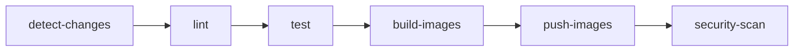
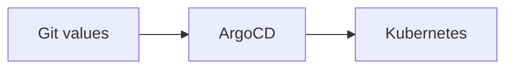

# Banking Demo: CI/CD — Build image và cập nhật deploy

> **Series**: Banking Demo — Full DevOps với Microservices  
> **Bài 7/11**: CI/CD — Build image và cập nhật deploy

---

## Mở đầu

Ở **bài 5**, chúng ta đã deploy Banking Demo bằng ArgoCD: Git là nguồn chân lý, chart và values nằm trong repo, sync là hành động áp dụng lên cluster. Ở **bài 6** đã có monitoring và KEDA. Nhưng mỗi lần sửa code (auth-service, account-service, frontend…), bạn vẫn phải **build image tay**, push lên registry, rồi **sửa image tag trong values**, commit và sync ArgoCD. Quy trình đó dễ sót và tốn thời gian.

**CI/CD** tự động hóa: khi push code, **CI** (Continuous Integration) chạy lint, test, build image và push lên registry; sau đó bạn (hoặc script) cập nhật **image tag trong Helm values**, commit và **CD** (ArgoCD) sync lên cluster. Bài này mô tả luồng CI/CD của Banking Demo (Phase 4): GitHub Actions build từng service, push lên GitLab Registry, và cách cập nhật deploy qua Git + ArgoCD.

---

## Luồng tổng quan

```
Code push/PR  →  CI (GitHub Actions)  →  Push images  →  Git (values)  →  CD (ArgoCD sync)
```

| Giai đoạn | Công cụ | Chức năng |
|-----------|---------|-----------|
| **CI** | GitHub Actions | Lint → Test → Build images → Push lên GitLab Registry |
| **CD** | ArgoCD | Đọc Helm values từ Git → Deploy lên Kubernetes |

CI không tự động sửa Git (image tag); trong repo Banking Demo, bước "cập nhật image tag trong values" vẫn do người (hoặc script riêng) thực hiện, rồi commit và ArgoCD sync. Cách này đơn giản, dễ kiểm soát và phù hợp với GitOps (mọi thay đổi cấu hình đều qua Git).

---

## CI — GitHub Actions

### Trigger

| Event | Điều kiện |
|-------|-----------|
| **Push** | Branch `main`, `develop` — chỉ khi path thay đổi (common, services, frontend, phase4-application-v2, .github/workflows/ci.yml) |
| **Pull Request** | Branch `main` — cùng path filter |
| **Manual** | `workflow_dispatch` — chọn services, skip tests, force push |

**Path filters** — CI **chỉ chạy** khi có thay đổi trong:

- `common/**`, `services/**`, `frontend/**`
- `phase4-application-v2/**`
- `.github/workflows/ci.yml`

**Không trigger** khi chỉ đổi: `phase2-helm-chart/**`, `phase3-monitoring-keda/**`, `k8s/**`, `*.md`. Nhờ đó, sửa Helm values hay tài liệu không gây build lại toàn bộ.

---

### Jobs (theo thứ tự)



| Job | Mô tả |
|-----|-------|
| **detect-changes** | Phát hiện service nào thay đổi (paths-filter); nếu `common` đổi → build tất cả. Output: danh sách service (auth-service, account-service, …) hoặc `all`. |
| **lint** | `ruff check` trên Python (common, services; phase4-application-v2). Chạy khi có service cần build. |
| **test** | `python -m compileall` + `pytest` (phase4-application-v2). Có thể bỏ qua qua manual input `skip_tests`. |
| **build-images** | Build Docker image **chỉ** cho service thay đổi (matrix: auth, account, transfer, notification, frontend). Output: artifact image (tar). |
| **push-images** | Push image lên GitLab Registry — **chỉ** khi push lên `main`/`develop` hoặc manual với `force_push`. Tag: SHA, branch, `latest` (main). |
| **security-scan** | Trivy scan image (HIGH, CRITICAL); `continue-on-error: true` để không chặn pipeline. |

---

### Detect changes và build có chọn lọc

Thay vì mỗi lần push đều build cả 5 service, CI dùng **paths-filter** và **output** từ job `detect-changes`:

- Đổi `services/auth-service/**` hoặc `phase4-application-v2/services/auth-service/**` → chỉ build **auth-service**.
- Đổi `common/**` hoặc `phase4-application-v2/common/**` → build **tất cả** (vì common dùng chung).
- Đổi `frontend/**` → chỉ build **frontend**.

Job `build-images` dùng **matrix** (5 service) nhưng mỗi runner chỉ build nếu service đó nằm trong danh sách thay đổi; không nằm trong list thì skip (upload artifact rỗng hoặc không chạy bước build). Job `push-images` tương tự: chỉ push service đã được build và chỉ khi branch là main/develop (hoặc manual force).

---

### Manual trigger (workflow_dispatch)

Trong GitHub: **Actions** → chọn workflow **CI** → **Run workflow**.

| Input | Mô tả |
|-------|-------|
| **services** | `all` hoặc chọn từng service (auth-service, account-service, transfer-service, notification-service, frontend) hoặc tổ hợp (vd: auth-service,frontend). |
| **skip_tests** | Bỏ qua stage test — dùng cho hotfix nhanh. |
| **force_push** | Push images kể cả khi không ở branch main (vd đang ở branch feature). |

---

### Image tag và registry

- **Registry**: GitLab Container Registry (vd: `registry.gitlab.com/kiettt164/banking-demo-payment/`).
- **Tag**:
  - `sha:<7 ký tự>` (vd: `abc1234`) — dùng cho deploy chính xác theo commit.
  - `branch` (vd: `main`, `develop`).
  - `latest` — chỉ khi push lên `main`.

Trong Helm values, deploy thường dùng **image.tag = SHA** để mỗi lần sync tương ứng đúng một commit.

---

### Secrets (GitHub)

Trong **Settings → Secrets and variables → Actions** cần:

| Secret | Mô tả |
|--------|-------|
| `GITLAB_USERNAME` | Username GitLab (đăng nhập registry). |
| `GITLAB_TOKEN` | Personal Access Token với quyền read_registry, write_registry. |

Không commit username/token vào repo; chỉ dùng qua `secrets.GITLAB_USERNAME`, `secrets.GITLAB_TOKEN` trong workflow.

---

## CD — Cập nhật deploy sau khi CI push image

Luồng CD trong Banking Demo (GitOps):

1. **CI** push images lên GitLab Registry (tag = commit SHA, branch, latest).
2. **Lấy SHA** từ GitHub Actions run (vd: `abc1234`) hoặc `git rev-parse --short HEAD`.
3. **Sửa** `image.tag` trong 5 file values: auth-service, account-service, transfer-service, notification-service, frontend (trong `phase2-helm-chart/banking-demo/charts/<service>/values.yaml`).
4. **Commit + push** lên Git.
5. **ArgoCD sync** — ArgoCD đọc Git, render Helm với values mới, apply lên cluster.



Không bắt buộc phải sync ngay; bạn có thể commit values trước, sau đó vào ArgoCD UI (hoặc CLI) sync khi sẵn sàng.

---

### Chỉ sync app, tránh động postgres/redis

Sau khi push values mới, nếu sync **toàn bộ** Application (một Application deploy cả chart), ArgoCD sẽ so sánh mọi resource; postgres/redis không đổi nhưng vẫn có thể bị "touch". Để **chỉ cập nhật 5 Deployment** (auth, account, transfer, notification, frontend) và không restart postgres/redis:

- **Cách 1 (một Application)**: ArgoCD UI → Application banking-demo → **Sync** → **Selective Sync** → chọn chỉ các resource thuộc 5 service đó (Deployment, Service tương ứng), bỏ chọn StatefulSet/Service của postgres, redis.
- **Cách 2 (per-service Applications)**: Chỉ sync 5 Application: `banking-demo-auth-service`, `banking-demo-account-service`, `banking-demo-transfer-service`, `banking-demo-notification-service`, `banking-demo-frontend`. Không sync `banking-demo-postgres`, `banking-demo-redis`.

---

## Thực hành: từ push code đến deploy

### Bước 1: Push code → CI chạy

```bash
# Sửa code (vd auth-service), commit và push
git add services/auth-service/ phase4-application-v2/services/auth-service/
git commit -m "feat: update auth flow"
git push origin main
```

Vào **GitHub → Actions** → run CI. Đợi Lint, Test, Build, Push xong. Ghi lại **commit SHA** (vd: `abc1234`) từ tên run hoặc từ summary.

### Bước 2: Cập nhật image tag trong Helm values

Chỉ sửa **5 file** (không sửa postgres, redis):

- `phase2-helm-chart/banking-demo/charts/auth-service/values.yaml`
- `phase2-helm-chart/banking-demo/charts/account-service/values.yaml`
- `phase2-helm-chart/banking-demo/charts/transfer-service/values.yaml`
- `phase2-helm-chart/banking-demo/charts/notification-service/values.yaml`
- `phase2-helm-chart/banking-demo/charts/frontend/values.yaml`

Trong mỗi file, đổi `image.tag` thành SHA (vd: `abc1234`). Ví dụ auth-service:

```yaml
auth-service:
  image:
    repository: registry.gitlab.com/kiettt164/banking-demo-payment/auth-service
    tag: abc1234
```

(Nếu chỉ đổi auth-service, có thể chỉ sửa file auth-service; các service khác giữ tag cũ.)

### Bước 3: Commit và push values

```bash
git add phase2-helm-chart/banking-demo/charts/auth-service/values.yaml \
  phase2-helm-chart/banking-demo/charts/account-service/values.yaml \
  phase2-helm-chart/banking-demo/charts/transfer-service/values.yaml \
  phase2-helm-chart/banking-demo/charts/notification-service/values.yaml \
  phase2-helm-chart/banking-demo/charts/frontend/values.yaml
git commit -m "chore: bump images to abc1234"
git push origin main
```

### Bước 4: ArgoCD sync

- **Một Application**: ArgoCD UI → banking-demo → **Sync** (nên dùng Selective Sync chỉ 5 service như trên).
- **Per-service**: Sync lần lượt (hoặc cùng lúc) 5 app: auth-service, account-service, transfer-service, notification-service, frontend.

### Bước 5: Kiểm tra

```bash
kubectl get pods -n banking
curl -s https://<ingress-host>/api/auth/health
```

---

## Tóm tắt luồng

| Bước | Hành động |
|------|------------|
| 1 | Push code → CI chạy (lint, test, build, push images). |
| 2 | Lấy commit SHA từ GitHub Actions. |
| 3 | Sửa `image.tag` trong 5 file values (auth, account, transfer, notification, frontend). |
| 4 | Commit + push values → ArgoCD sync (chỉ 5 app hoặc Selective Sync). |
| 5 | Verify + smoke test (tùy chọn). |

---

## Mở rộng (tùy chọn)

- **Tự động cập nhật values**: Script hoặc job CI (sau push image) clone repo, sửa 5 file values bằng `yq`/sed, commit và push. Cần cấu hình token Git với quyền write repo. Banking Demo hiện không dùng; bạn có thể thêm nếu muốn full auto.
- **Trigger ArgoCD sync từ CI**: Gọi ArgoCD API (hoặc `argocd app sync`) sau khi push values. Cần ArgoCD token và quyền; có thể làm trong bước "update values" nếu đã tự động commit.
- **Environment khác**: Staging dùng branch `develop` + tag branch hoặc SHA; production dùng `main` + SHA. Cùng workflow CI, khác valueFiles hoặc Application (đã nói ở bài 5).

---

## Lưu ý

- **Secrets**: `GITLAB_USERNAME`, `GITLAB_TOKEN` chỉ cấu hình trong GitHub Secrets; không ghi trong workflow dạng plain text.
- **Path filter**: Sửa Helm chart hoặc K8s manifest trong `phase2-helm-chart/**` không trigger CI; chỉ khi sửa code app (common, services, frontend, phase4-application-v2) mới build.
- **DB migration**: Nếu có thay đổi schema (vd Phase 4 thêm cột), cần chạy migration trước khi deploy version mới; chi tiết xem `phase4-application-v2/README.md`.

---

## Tóm tắt

- **CI** (GitHub Actions): Trigger theo path; detect-changes → lint → test → build-images (có chọn lọc) → push-images (main/develop hoặc manual force) → security-scan.
- **CD**: Cập nhật `image.tag` trong 5 file Helm values theo SHA, commit + push; ArgoCD sync (Selective Sync hoặc chỉ 5 Application) để tránh động postgres/redis.
- Luồng Banking Demo giữ **Git làm nguồn chân lý**: mọi thay đổi deploy qua Git; CI chỉ build và push image, bước "ghi tag vào values" có thể làm tay hoặc tự động hóa thêm sau.

Bài tiếp theo có thể đi vào **Security & Reliability** (Phase 7): JWT hardening, Kong plugins, SLO/alerting.

---

## Bài tiếp theo

**Bài 8**: *Security & Reliability (Phase 7)*

- Auth hardening (JWT design)
- Kong security plugins
- SLO và alerting (SRE)

---

*Tags: #cicd #github-actions #argocd #helm #kubernetes #devops #microservices #phase4*
