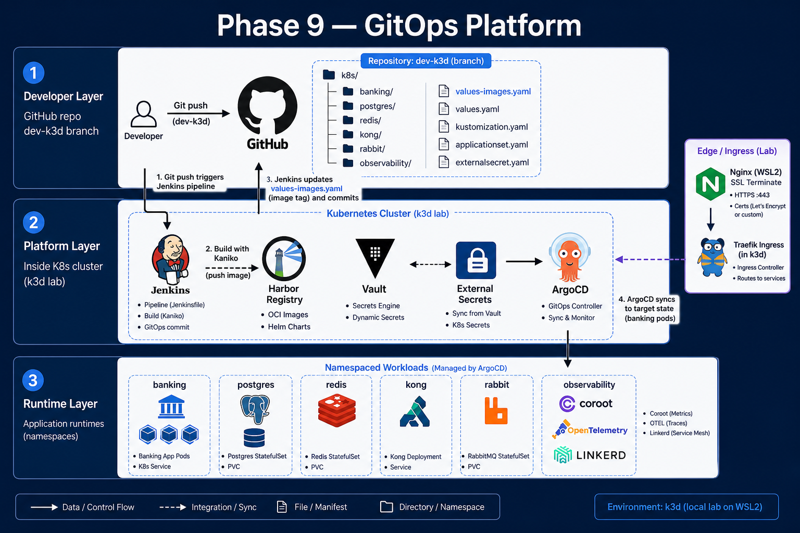
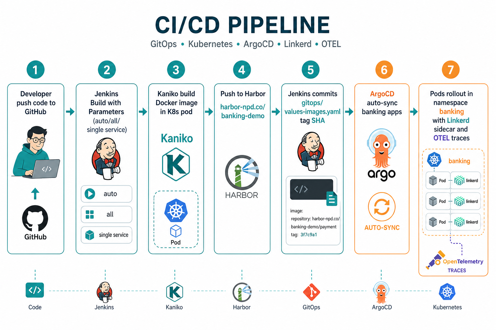
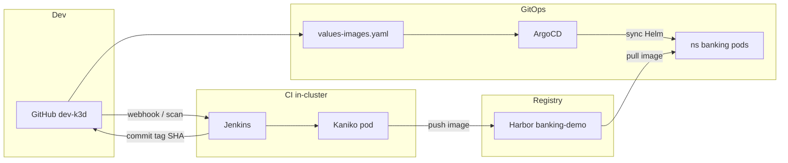
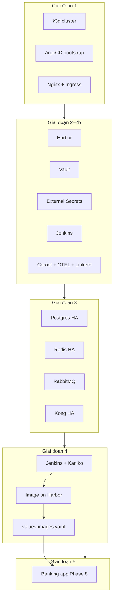
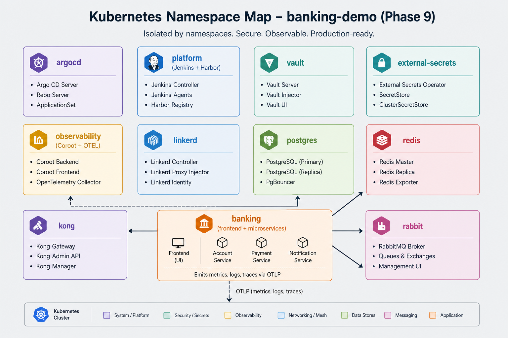
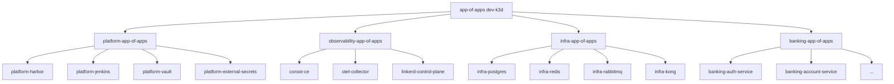
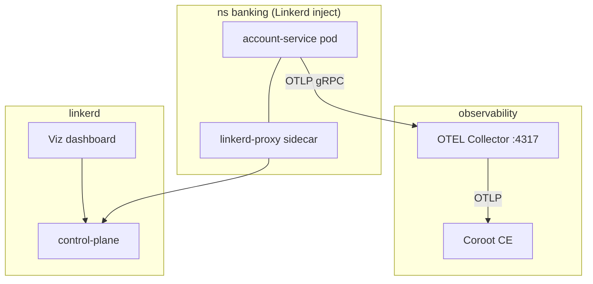

# Banking Demo: Phase 9 — GitOps Platform (CI in-cluster, Harbor, Vault, Observability)

> **Series**: Banking Demo — Full DevOps với Microservices  
> **Bài 10/12**: Phase 9 — GitOps Platform trên k3d  
> **Repo**: [github.com/kevinram164/banking-demo](https://github.com/kevinram164/banking-demo) — nhánh `dev-k3d`

---

## Mở đầu

Mình có một khoảng thời gian bận dự án ở công ty và ôn phỏng vấn kỹ thuật IBM — series Banking Demo phải bỏ dở khá lâu mới quay lại viết tiếp. Hiện tại mình đang là **Automation Engineer tại IBM**, hàng ngày vẫn quanh pipeline và automation; Phase 9 là phần mình tự dựng thêm lúc rảnh để nối các phase trước thành một luồng GitOps chạy được trên laptop (k3d + WSL2), không liên quan trực tiếp tới dự án công ty.

Bài này ghi lại những gì mình đã làm và vướng phải khi pick up lại — hy vọng hữu ích nếu bạn cũng đang học K8s/GitOps hoặc chuẩn bị phỏng vấn mảng DevOps tương tự.

Qua các bài trước trong series, chúng ta đã có:

| Bài | Nội dung |
|-----|----------|
| **4** | Helm chart `banking-demo` |
| **5** | ArgoCD GitOps — deploy chart từ Git |
| **7** | CI/CD với GitHub Actions + GitLab Registry |
| **8–9** | Phase 5 — tách namespace, Postgres/Redis HA, Kong |

**Phase 9** là bước gom toàn bộ thành một **nền tảng GitOps hoàn chỉnh** chạy **trong Kubernetes**:

- **CI không còn phụ thuộc GitHub Actions** — Jenkins + Kaniko build ngay trong cluster.
- **Registry riêng** — Harbor thay GitLab/Docker Hub cho image nội bộ.
- **Secret tập trung** — Vault + External Secrets Operator (ESO).
- **Observability + Service mesh** — Coroot CE, OpenTelemetry Collector, Linkerd.
- **CD vẫn là ArgoCD** — App of Apps, sync waves, Helm values tách theo mục đích.

Bài viết mô tả **kiến trúc**, **mô hình triển khai 5 giai đoạn**, **luồng CI/CD**, và các **bài học thực tế** khi lab trên **k3d + WSL2** (môi trường gần production nhưng chạy trên laptop).

---

## Phase 9 giải quyết vấn đề gì?

Trước Phase 9, luồng thường gặp:

```text
Dev push code → GitHub Actions (runner ngoài cluster) → Registry cloud
              → sửa tay image tag trong values → ArgoCD sync
```

Nhược điểm khi muốn demo **full stack on-prem / air-gapped / lab k3d**:

| Vấn đề | Phase 9 |
|--------|---------|
| CI runner ngoài cluster, phải cấu hình kubeconfig/Docker riêng | Jenkins **in-cluster**, Kaniko pod build không cần Docker daemon |
| Registry cloud, rate limit, credential rải rác | **Harbor** nội bộ, robot account `ci-push` / `k8s-pull` |
| Secret commit plaintext hoặc `kubectl create secret` thủ công | **Vault KV** + ESO sync vào K8s Secret |
| Monitoring Phase 3 tách rời, chưa gắn Phase 8 | **Coroot + OTEL + Linkerd** wired qua `values-observability.yaml` |
| Deploy app sớm → ImagePullBackOff vì chưa có image | **Thứ tự 5 giai đoạn** — banking app **sau cùng** |

**Mục tiêu Phase 9:** mọi thứ (trừ GitHub source + manifest GitOps) nằm trong cluster; push code → image lên Harbor → tag vào Git → ArgoCD rollout — **không sửa tay trên cluster**.

---

## Tại sao dùng k3d?

Phase 9 lab chạy trên **k3d** (Kubernetes in Docker) trên **WSL2 + Docker Desktop**, không phải cluster bare-metal hay EKS/GKE. Đây là lựa chọn **có chủ đích**, không phải vì k3d “đẹp hơn” cluster thật.

### k3d là gì?

**k3d** bọc **K3s** (Kubernetes distribution nhẹ của Rancher) vào container Docker: vài lệnh là có cluster multi-node (1 server + N agent), kubeconfig, LoadBalancer tích hợp. Toàn bộ control plane và worker chạy **trong Docker** trên máy dev — phù hợp laptop, không cần dàn máy riêng.

### So sánh nhanh với các lựa chọn khác

| Tiêu chí | **k3d (K3s)** | kind | minikube | Cluster thật (kubeadm / cloud) |
|----------|---------------|------|----------|--------------------------------|
| Thời gian tạo cluster | ~1 phút | ~1–2 phút | ~2–5 phút | Giờ / ngày |
| RAM tối thiểu (lab Phase 9) | ~16–24 GB (full stack) | Tương tự | Tương tự | 32 GB+ / nhiều node |
| Multi-node | Có (`--agents 5`) | Có | Hạn chế | Có |
| LoadBalancer sẵn | Có (`serverlb` map port) | Cần MetalLB / port-forward | tunnel / NodePort | Cloud LB / MetalLB |
| Giống production | Đủ cho GitOps lab | Đủ cho CI/CD lab | Dev đơn giản | Chuẩn nhất |
| Phụ thuộc | Docker | Docker | VM hoặc Docker | Hạ tầng riêng |

**Vì sao chọn k3d thay vì kind/minikube?**

- **LoadBalancer map port rõ ràng** — `9080:80@loadbalancer` → Nginx WSL2 proxy vào Traefik mà không vướng NodePort từ Windows host (lỗi thường gặp khi lab WSL2).
- **Multi-agent mặc định** — Phase 9 cần test pod schedule lên agent, registry mirror (`registries.yaml` trên từng node), giống cluster thật hơn single-node.
- **K3s nhẹ** — bỏ bớt component không cần cho lab; vẫn đủ API Kubernetes, Helm, ArgoCD, CNI, Ingress (Traefik).
- **Script hóa dễ** — `k3d cluster create/delete/stop/start` trong repo (`k3d/cluster-create.sh`), reset lab nhanh khi thử sai.

### Lý do cụ thể với Banking Demo Phase 9

| Nhu cầu Phase 9 | k3d giúp được gì |
|-----------------|------------------|
| **Full stack trên laptop** | Harbor + Jenkins + Vault + Coroot + Linkerd + Postgres/Redis/Kong — không cần VPS |
| **GitOps end-to-end** | Cluster “thật” đủ để ArgoCD App of Apps, sync waves, Helm — không mock |
| **CI in-cluster (Kaniko)** | Pod build chạy trên node k3d; pull/push Harbor qua Service nội bộ + `registries.yaml` |
| **Domain lab `*-npd.co`** | Port map LB + Nginx WSL2 + `hosts` Windows → trải nghiệm gần production (HTTPS, nhiều UI) |
| **Nhánh `dev-k3d` tách biệt** | Xóa cluster = reset sạch; không ảnh hưởng config production/main |
| **Học / viết series Viblo** | Đọc giả reproduce được; chi phí = 0 cloud |

### Môi trường: WSL2 + Docker Desktop

```text
Windows (browser, hosts file 127.0.0.1)
    │
    ▼
WSL2 Ubuntu (kubectl, k3d, nginx, scripts)
    │
    ▼
Docker Desktop (engine chạy container k3d-npd-server-0, agent-*, serverlb)
    │
    ▼
Kubernetes cluster "npd" bên trong
```

- **Windows** chỉ cần trình duyệt + file `hosts` — truy cập `https://argocd-npd.co`, `https://banking-npd.co`, …
- **WSL2** là nơi chạy lệnh (`kubectl`, `k3d`, Nginx terminate SSL) — quen thuộc với dev Linux.
- **Docker Desktop** cung cấp engine — k3d không cài K8s trực tiếp lên WSL kernel.

Đây là combo phổ biến trên máy Windows dev; không bắt buộc Linux bare-metal.

### Những gì k3d **không** thay thế được

Cần nói thẳng để tránh kỳ vọng sai:

| Hạn chế lab k3d | Ghi chú |
|-----------------|--------|
| **Storage** | `local-path` — không test NFS/CSI production |
| **HA control plane** | 1 server k3s — không phải 3 master etcd |
| **TLS / cert** | Self-signed Nginx — production cần cert CA thật |
| **eBPF / node-agent** | Coroot node-agent thường tắt trên WSL2 |
| **Performance** | Laptop ≠ throughput cluster production |
| **Network** | Overlay Docker — khác CNI Calico/Cilium datacenter |

Phase 9 trên k3d trả lời câu hỏi: *“Luồng GitOps + CI in-cluster + platform stack có chạy được và debug được trên máy dev không?”* — **Có**. Còn hardening production (Vault HA, cert, backup Harbor, node pool riêng) là bước sau, trên cluster thật.

### Khi nào nên chuyển khỏi k3d?

- Demo khách / staging: cluster cloud (EKS, AKS, GKE) hoặc on-prem kubeadm.
- Cần storage class, GPU, bare-metal network policy phức tạp.
- Load test / SLO production.

Manifest GitOps Phase 9 (`gitops-platform/`, Helm values) **giữ nguyên ý tưởng** — chỉ đổi `storageClass`, ingress class, resource limit, cert issuer.

---

## Kiến trúc tổng thể

### Hình minh họa (upload lên Viblo)

Chèn 3 ảnh sau vào bài (thư mục `articles/viblo-series/assets/`):

| File | Nội dung |
|------|----------|
| `phase9-architecture-overview.png` | Tổng quan GitOps platform |
| `phase9-cicd-flow.png` | Luồng CI/CD Jenkins → Harbor → ArgoCD |
| `phase9-namespace-map.png` | Bản đồ namespace Kubernetes |



### Luồng request người dùng (runtime)

```text
Browser (Windows hosts 127.0.0.1)
    │
    ▼
Nginx WSL2 (:443 — SSL terminate, cert self-signed)
    │
    ▼
k3d LoadBalancer :9080 → Traefik Ingress
    │
    ├── banking-npd.co  → Kong (ns kong) → microservices (ns banking)
    ├── argocd-npd.co   → ArgoCD UI
    ├── harbor-npd.co   → Harbor UI / Registry API
    ├── jenkins-npd.co  → Jenkins UI
    ├── vault-npd.co    → Vault UI
    ├── coroot-npd.co   → Coroot (metrics / logs / traces)
    └── linkerd-npd.co  → Linkerd Viz (service mesh dashboard)
```

**Mô hình SSL:** Nginx WSL2 terminate HTTPS; Traefik trong cluster nhận HTTP (SSL passthrough / terminate ngoài). Phù hợp lab k3d — production nên dùng cert Let's Encrypt hoặc cert nội bộ có SAN đúng.

### Luồng CI/CD (developer)





---

## Mô hình triển khai — 5 giai đoạn

Điểm **quan trọng nhất** khi bootstrap Phase 9: **không apply banking app cho đến khi CI đã push image lên Harbor**.

| Giai đoạn | Việc làm | ArgoCD deploy banking? |
|-----------|----------|------------------------|
| **1** | k3d cluster, ArgoCD bootstrap, Nginx, Ingress | Không |
| **2** | Platform: Harbor, Vault, ESO, Jenkins | Không |
| **2b** | Observability: Coroot, OTEL, Linkerd | Không |
| **3** | Infra: Postgres, Redis, RabbitMQ, Kong + secrets | Không |
| **4** | Jenkins pipeline green → image trên Harbor → `values-images.yaml` commit | Không |
| **5** | Apply `banking-app-of-apps` → sync → pods Running | **Có** |



Checkpoint **Giai đoạn 4**:

- Harbor UI: project `banking-demo` có image `<service>:<sha7>`.
- Git: commit mới trên `phase9-gitops-platform/gitops/values-images.yaml`.
- Jenkins pipeline **green**.

Chi tiết từng bước: [`phase9-gitops-platform/K3D-DEPLOY-GUIDE.md`](../../phase9-gitops-platform/K3D-DEPLOY-GUIDE.md).

---

## Bản đồ namespace



| Namespace | Thành phần chính | Domain lab |
|-----------|------------------|------------|
| `argocd` | ArgoCD controller, UI | `argocd-npd.co` |
| `platform` | Jenkins, Harbor | `jenkins-npd.co`, `harbor-npd.co` |
| `vault` | Vault server (dev mode lab) | `vault-npd.co` |
| `external-secrets` | ESO controller | — |
| `observability` | Coroot CE, OTEL Collector | `coroot-npd.co` |
| `linkerd`, `linkerd-viz` | Control plane, Viz dashboard | `linkerd-npd.co` |
| `postgres` | Postgres HA (Phase 5) | — |
| `redis` | Redis Sentinel HA | — |
| `kong` | Kong gateway DB mode | — |
| `rabbit` | RabbitMQ (Phase 8) | — |
| `banking` | Frontend, api-producer, consumers, ingress | `banking-npd.co` |

Phase 5 đã **tách namespace** theo bounded context — Phase 9 **không gộp lại** mà deploy qua **App of Apps** riêng: `platform`, `observability`, `infra`, `banking`.

---

## Cấu trúc repo Phase 9

```text
phase9-gitops-platform/
├── PHASE9.md                    # Tổng quan ngắn
├── K3D-DEPLOY-GUIDE.md          # Hướng dẫn end-to-end k3d
├── bootstrap/BOOTSTRAP.md       # Thứ tự bootstrap
├── gitops/
│   ├── values-images.yaml       # CI cập nhật image tag ← quan trọng
│   ├── values-observability.yaml # OTEL endpoint + Linkerd inject
│   └── values-gitops-env.yaml   # Harbor host, branch
├── gitops-platform/             # Manifest ArgoCD
│   ├── project.yaml
│   └── applications/
│       ├── platform-app-of-apps.yaml
│       ├── observability-app-of-apps.yaml
│       ├── infra-app-of-apps.yaml
│       └── banking-app-of-apps.yaml
├── jenkins-shared-library/      # Pipeline Groovy
├── vault/                       # ESO + hướng dẫn Vault CLI
├── harbor/
└── observability/               # Values Coroot, OTEL, Linkerd k3d
```

**Nguyên tắc tách values:**

| File | Ai sửa | Mục đích |
|------|--------|----------|
| `values-images.yaml` | **Jenkins CI** (tự động) | Image tag từ Harbor |
| `values-observability.yaml` | DevOps (ít đổi) | OTEL, Linkerd annotation |
| `charts/*/values.yaml` | Dev (Phase 2 chart) | Cấu hình service, resource, probe |

ArgoCD Application banking merge nhiều valueFiles — giống bài 5 nhưng tách file theo **trách nhiệm**.

---

## ArgoCD App of Apps

Phase 2 dùng per-service Application trong `phase2-helm-chart/argocd/`. Phase 9 mở rộng thành **4 nhóm App of Apps**:



**Sync waves** (annotation `argocd.argoproj.io/sync-wave`):

- Wave thấp chạy trước (CRD, namespace, Vault seed).
- Kong wave 2 — sau Postgres Ready + job tạo DB `kong`.
- Banking wave 2 — sau infra + image sẵn sàng.

---

## CI in-cluster: Jenkins + Kaniko + Harbor

### Tại sao Kaniko?

Pod Jenkins agent **không mount Docker socket** — Kaniko build image trong userspace, push trực tiếp lên registry. Phù hợp Kubernetes-native CI.

```text
Jenkins controller (platform ns)
    │
    └── Pod agent: jnlp + kaniko container
            │
            └── /kaniko/executor
                  --context=dir://$(pwd)    ← repo root
                  --dockerfile=phase8-application-v3/services/.../Dockerfile
                  --destination=harbor-npd.co/banking-demo/account-service:ae63979
```

**Shared library** (`jenkins-shared-library/`):

| Class | Vai trò |
|-------|---------|
| `PipelineConfig` | Danh sách service + Dockerfile path |
| `ChangeDetector` | Chọn service cần build (parameter `BUILD_TARGET`) |
| `KanikoBuilder` | Build + push Harbor |
| `GitOpsUpdater` | Commit `values-images.yaml` + push Git |

### BUILD_TARGET — build một service hoặc tất cả

Jenkins **Build with Parameters**:

| Giá trị | Hành vi |
|---------|---------|
| `auto` | Chỉ build service có diff trong commit (mặc định webhook) |
| `all` | Build cả 5 backend service |
| `account-service`, … | Chỉ build **một** service |

Push bình thường → `auto`. Rebuild image sau sửa Dockerfile → chọn service cụ thể.

### Dockerfile Phase 8

Build context = **repo root** (`.`), COPY path đầy đủ:

```dockerfile
FROM python:3.11-slim
WORKDIR /app
COPY phase8-application-v3/common /app/common
COPY phase8-application-v3/services/account-service /app
RUN pip install --no-cache-dir -r common/requirements.txt \
    && python -c "import uvicorn"
CMD ["python", "-m", "uvicorn", "main:app", "--host", "0.0.0.0", "--port", "8002"]
```

---

## CD: `values-images.yaml` và GitOps

Sau build, Jenkins cập nhật tag (short SHA) cho từng service đã build:

```yaml
account-service:
  imagePullSecrets:
    - name: harbor-pull-creds
  image:
    repository: harbor-npd.co/banking-demo/account-service
    tag: ae63979
    pullPolicy: Always
```

ArgoCD Application trỏ valueFiles:

```yaml
helm:
  valueFiles:
    - charts/common/values.yaml
    - charts/account-service/values.yaml
    - values-phase8.yaml
    - ../../phase9-gitops-platform/gitops/values-images.yaml
    - ../../phase9-gitops-platform/gitops/values-observability.yaml
```

**Auto-sync** → Deployment rollout → pod mới pull image từ Harbor.

---

## Vault + External Secrets

Thay `kubectl create secret` rải rác:

```text
Vault KV (secret/banking/db, secret/platform/jenkins, ...)
        │
        ▼
ExternalSecret (ESO)
        │
        ▼
K8s Secret (banking-db-secret, harbor-pull-creds, ...)
        │
        ▼
Pod env / volumeMount
```

**Thứ tự lab quan trọng:**

1. Vault pod Running → seed KV (`vault kv put secret/banking/db ...`).
2. Sync ESO controller.
3. Tạo `vault-token` Secret **trước** ClusterSecretStore.
4. Apply ExternalSecret manifests.

Harbor pull secret `harbor-pull-creds` (ns `banking`) — robot account **`k8s-pull`**, quyền Pull project `banking-demo`.

---

## Observability: Coroot + OTEL + Linkerd



| Thành phần | Vai trò |
|------------|---------|
| **OTEL Collector** | Nhận trace/metric từ app Phase 8 (`observability.py`) |
| **Coroot CE** | UI thống nhất metrics, logs, traces (ClickHouse backend) |
| **Linkerd** | mTLS mesh — chỉ inject ns `banking` (lab) |
| **Linkerd Viz** | Dashboard latency, success rate giữa các service |

Cấu hình inject:

```yaml
# values-observability.yaml
namespace:
  annotations:
    linkerd.io/inject: enabled

account-service:
  extraEnv:
    OTEL_EXPORTER_OTLP_ENDPOINT: "http://opentelemetry-collector.observability.svc.cluster.local:4317"
    OTEL_SERVICE_NAME: "account-service"
```

**Lưu ý lab WSL2:** Coroot node-agent (eBPF) thường **tắt** — traces vẫn vào Coroot qua OTLP từ app.

---

## k3d lab — các điểm cần biết

### Registry mirror (fix ImagePullBackOff x509)

Kubelet trên **agent node** pull `harbor-npd.co` qua HTTPS → cert self-signed Nginx WSL2 → **x509**.

Giải pháp: `k3d/registries.yaml` mirror sang HTTP nội bộ:

```yaml
mirrors:
  harbor-npd.co:
    endpoint:
      - http://harbor-registry.platform.svc.cluster.local:5000
configs:
  harbor-npd.co:
    tls:
      insecure_skip_verify: true
```

Script `configure-harbor-registry-k3d.sh` copy file này lên **mọi server + agent** (không phải `k3d-npd-tools` hay `serverlb`).

### StorageClass

Lab k3d dùng `local-path` — **không** dùng `nfs-client` / `pg-client` từ Phase 5 production values.

### Bitnami images

Chart Bitnami pin tag Docker Hub cũ → dùng `bitnamilegacy/*` + `allowInsecureImages: true`.

---

## Luồng phát triển hàng ngày

```text
1. Sửa code phase8-application-v3/services/account-service/
2. git push origin dev-k3d
3. Jenkins (auto) build account-service → Harbor
4. Jenkins commit tag mới values-images.yaml
5. ArgoCD sync banking-account-service
6. kubectl get pods -n banking
7. Mở coroot-npd.co / linkerd-npd.co kiểm tra trace + mesh
```

| Bước | Công cụ kiểm tra |
|------|------------------|
| Build OK? | Jenkins UI, Harbor UI |
| Tag Git? | `git log -1 -- phase9-gitops-platform/gitops/values-images.yaml` |
| Sync? | ArgoCD UI — `banking-*` Synced |
| Pod? | `kubectl get pods -n banking` |
| Trace? | Coroot → Traces (sau có traffic HTTP) |

---

## Bài học / lỗi thường gặp

| Triệu chứng | Nguyên nhân | Cách xử lý |
|-------------|-------------|------------|
| `x509: certificate is not valid for harbor-npd.co` | Kubelet pull HTTPS, cert self-signed | `registries.yaml` trên **tất cả agent** |
| `harbor-registry not found` vs `harbor-pull-creds` | Lệch tên secret vs values | Dùng thống nhất `harbor-pull-creds` trong `values-images.yaml` |
| `uvicorn: not found` | Kaniko cache layer lỗi | `kanikoUseCache: false`, rebuild với BUILD_TARGET |
| Banking ImagePullBackOff sớm | Apply app trước Giai đoạn 4 | Đợi pipeline green + image trên Harbor |
| Linkerd pod `CreateContainerConfigError` | Secret identity sai type | `kubernetes.io/tls`, ConfigMap key `ca-bundle.crt` |
| Coroot traces trống | Chưa có traffic / chưa rollout pod OTEL | `kubectl rollout restart -n banking` + gọi API |
| Bitnami ImagePullBackOff 404 | Tag gỡ khỏi Docker Hub | `bitnamilegacy/postgresql`, `bitnamilegacy/redis` |

---

## So sánh Phase 7 (GitHub Actions) vs Phase 9 (Jenkins in-cluster)

| Tiêu chí | Phase 7 — GitHub Actions | Phase 9 — Jenkins + Harbor |
|----------|--------------------------|------------------------------|
| Runner | GitHub-hosted / self-hosted ngoài K8s | Pod trong cluster |
| Registry | GitLab / Docker Hub | Harbor nội bộ |
| Cập nhật tag | Thủ công hoặc script | Jenkins commit Git tự động |
| Secret | GitHub Secrets | Vault + ESO |
| Observability | Phase 3 riêng | Coroot + OTEL + Linkerd tích hợp |
| Phù hợp | OSS demo, CI đơn giản | Lab/on-prem, full platform |

Phase 9 **không thay thế** kiến thức bài 7 — nó **nâng cấp** khi bạn muốn mô hình enterprise hơn.

---

## Kết luận

Phase 9 gom **platform + CI + CD + secret + observability** thành một lab GitOps có thể chạy trên **k3d/WSL2**:

1. **Thứ tự bootstrap** — platform → infra → CI → app (5 giai đoạn).
2. **Git là nguồn chân lý** — ArgoCD sync; CI chỉ commit tag image.
3. **In-cluster CI** — Jenkins + Kaniko + Harbor, không phụ thuộc runner ngoài.
4. **Parameter hóa pipeline** — `BUILD_TARGET` build một service hoặc all.
5. **Observability end-to-end** — OTEL từ app Phase 8 → Coroot; Linkerd mesh ns banking.

**Tài liệu trong repo:**

- [K3D-DEPLOY-GUIDE.md](../../phase9-gitops-platform/K3D-DEPLOY-GUIDE.md) — triển khai từ đầu
- [PHASE9.md](../../phase9-gitops-platform/PHASE9.md) — tóm tắt kiến trúc
- [bootstrap/BOOTSTRAP.md](../../phase9-gitops-platform/bootstrap/BOOTSTRAP.md) — checklist bootstrap

**Bài tiếp theo (dự kiến):** tinh chỉnh production — cert thật, Vault HA, backup Harbor, hardening Linkerd.

---

## Tài liệu tham khảo

- [ArgoCD App of Apps](https://argo-cd.readthedocs.io/en/stable/operator-manual/cluster-bootstrapping/)
- [Kaniko](https://github.com/GoogleContainerTools/kaniko)
- [Harbor](https://goharbor.io/docs/)
- [External Secrets Operator](https://external-secrets.io/)
- [Coroot](https://coroot.com/docs/)
- [Linkerd](https://linkerd.io/2/overview/)
- [k3d registries](https://k3d.io/v5.6.0/usage/registries/)

---

*Ảnh minh họa: xem thư mục `articles/viblo-series/assets/phase9-*.png`. Trên Viblo: Upload → chèn vào vị trí tương ứng trong bài.*
