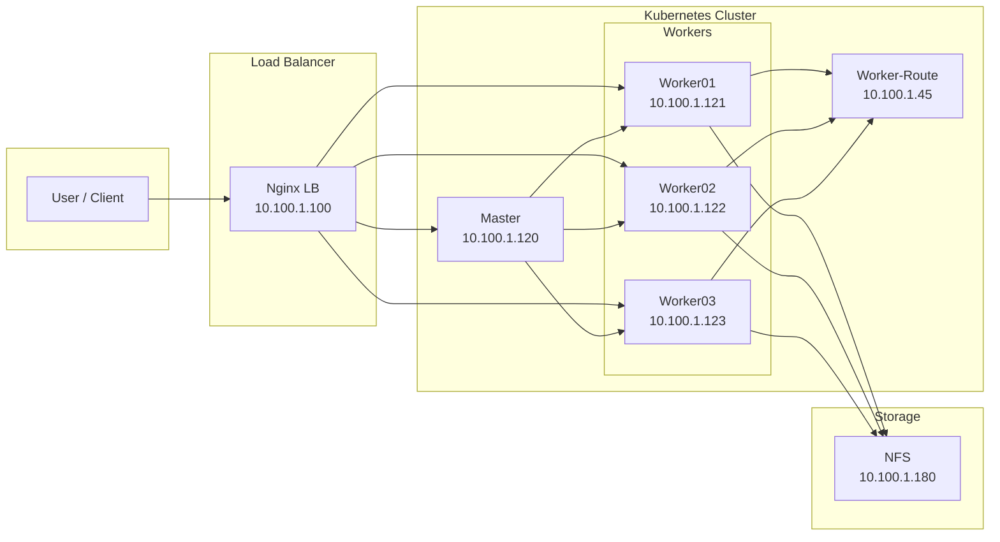
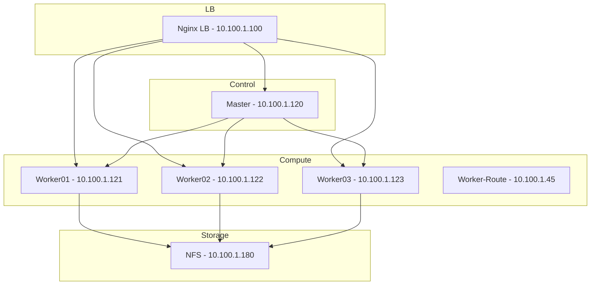

# Sơ đồ tổ chức hạ tầng — Banking Demo

## Hình ảnh (đã render)

File ảnh dùng cho Viblo: **`assets/banking-demo-infrastructure-diagram.png`**

Trong Viblo: vào bài viết → chèn ảnh → upload file này hoặc kéo thả.

---

## Mermaid (dùng trong Viblo nếu hỗ trợ code block Mermaid)

Copy đoạn dưới vào Viblo, đặt trong code block với language `mermaid`:

---

## Phiên bản đơn giản (chỉ các node + IP)

---

## Bảng tóm tắt (chèn vào bài Viblo)

| Vai trò        | Host        | IP           |
|----------------|-------------|--------------|
| Nginx LB       | (LB)        | 10.100.1.100 |
| Master         | Master      | 10.100.1.120 |
| Worker 1       | Worker01    | 10.100.1.121 |
| Worker 2       | Worker02    | 10.100.1.122 |
| Worker 3       | Worker03    | 10.100.1.123 |
| Worker-Route   | Worker-route| 10.100.1.45  |
| NFS            | NFS         | 10.100.1.180 |
