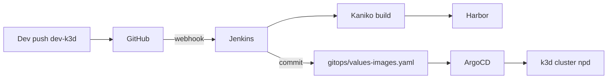

# Nhánh `dev-k3d` — Phát triển app trên k3d (Jenkins CI + ArgoCD CD)

Nhánh **`dev-k3d`** dành riêng cho môi trường lab **k3d trên WSL2**. Không dùng **GitHub Actions**; CI/CD chạy **trong cluster** (Jenkins + Kaniko + Harbor) và CD qua **ArgoCD GitOps**.

---

## So sánh với `main`

| | `main` | `dev-k3d` |
|--|--------|-----------|
| CI | GitHub Actions (`.github/workflows/ci.yml`) | **Jenkins** (pod Kaniko) |
| Registry | GitLab (Phase 4) / tùy cấu hình | **Harbor** (in-cluster) |
| CD | ArgoCD (tùy setup) | **ArgoCD** → `targetRevision: dev-k3d` |
| Code app | Phase 8 | **Phase 8** (`phase8-application-v3/`) |
| Cluster | Production-like / VM | **k3d-npd** (WSL2) |
| Infra guide | — | [`WSL2-K3D-ARGOCD-GUIDE.md`](./WSL2-K3D-ARGOCD-GUIDE.md) |

GitHub Actions **không trigger** trên `dev-k3d` (chỉ `main`, `develop`).

---

## Luồng end-to-end



| Bước | Hành động |
|------|-----------|
| 1 | Code trên nhánh `dev-k3d`, path `phase8-application-v3/**` |
| 2 | Push → Jenkins build image → push Harbor |
| 3 | Jenkins commit tag mới vào `phase9-gitops-platform/gitops/values-images.yaml` trên **`dev-k3d`** |
| 4 | ArgoCD (watch `dev-k3d`) sync → rollout pods namespace `banking` |

---

## Tạo và dùng nhánh

```bash
# Lần đầu (từ main)
git checkout main
git pull
git checkout -b dev-k3d
git push -u origin dev-k3d

# Hàng ngày
git checkout dev-k3d
git pull
# ... sửa code phase8 ...
git add phase8-application-v3/
git commit -m "feat: ..."
git push origin dev-k3d
```

---

## Bootstrap cluster k3d + ArgoCD

**Hướng dẫn đầy đủ (cluster mới tinh):** [phase9-gitops-platform/K3D-DEPLOY-GUIDE.md](../phase9-gitops-platform/K3D-DEPLOY-GUIDE.md)

Tóm tắt (4 giai đoạn — **app deploy sau cùng**):

```bash
./k3d/cluster-create.sh
# Giai đoạn 1: ArgoCD bootstrap + Nginx — xem K3D-DEPLOY-GUIDE.md mục 3

kubectl apply -f phase9-gitops-platform/argocd/project.yaml -n argocd

# Giai đoạn 2: Platform (Harbor, Vault, Jenkins)
kubectl apply -f phase9-gitops-platform/environments/dev-k3d/argocd/applications/platform-app-of-apps.yaml -n argocd

# Giai đoạn 3: Infra (Postgres, Redis, Rabbit, Kong)
kubectl apply -f phase9-gitops-platform/environments/dev-k3d/argocd/applications/infra-app-of-apps.yaml -n argocd

# Giai đoạn 4: CI/CD Jenkins → Harbor → commit values-images.yaml

# Giai đoạn 5: Banking app (SAU CI/CD)
kubectl apply -f phase9-gitops-platform/environments/dev-k3d/argocd/applications/banking-app-of-apps.yaml -n argocd
```

Chi tiết từng bước: [K3D-DEPLOY-GUIDE.md](../phase9-gitops-platform/K3D-DEPLOY-GUIDE.md).

---

## Jenkins

### Job

- **Multibranch Pipeline** hoặc Pipeline job trỏ repo, branch **`dev-k3d`**
- Jenkinsfile: [`Jenkinsfile`](../Jenkinsfile) (root repo)
- Shared library: `phase9-gitops-platform/jenkins-shared-library/`

### Credentials (Jenkins)

| ID | Mục đích |
|----|----------|
| `harbor-ci-push` | Push image Harbor |
| `github-gitops-push` | Commit `values-images.yaml` lên `dev-k3d` |

### Webhook GitHub

Repository → Settings → Webhooks → Push events → branch filter `dev-k3d` → URL Jenkins.

Cấu hình môi trường: [`phase9-gitops-platform/environments/dev-k3d/gitops-env.yaml`](../phase9-gitops-platform/environments/dev-k3d/gitops-env.yaml)

---

## ArgoCD trên `dev-k3d`

- Mọi Application dùng **`targetRevision: dev-k3d`**
- Banking apps merge: `values-phase8.yaml` + `gitops/values-images.yaml`
- AppProject: `banking-platform` (namespace Phase 5 + `banking`)

Sync thủ công lần đầu: ArgoCD UI → `banking-platform-root-dev-k3d` → Sync.

### Thứ tự sync gợi ý (k3d lab)

1. `platform-external-secrets` (nếu dùng Vault)
2. `infra-rabbitmq` (Phase 8)
3. `banking-namespace`
4. Banking services (auth, account, …)
5. Platform stubs (Harbor, Jenkins) khi đủ RAM

Có thể **tắt** `infra-app-of-apps` / `platform-app-of-apps` lúc đầu, chỉ sync `banking-app-of-apps`.

---

## Harbor (lab k3d)

Image naming:

```text
harbor-npd.co/banking-demo/auth-service:<sha7>
```

Cập nhật trong `phase9-gitops-platform/gitops/values-images.yaml` (Jenkins tự commit).

---

## Phát triển app (Phase 8)

| Service | Dockerfile |
|---------|------------|
| api-producer | `phase8-application-v3/producer/Dockerfile` |
| auth-service | `phase8-application-v3/services/auth-service/Dockerfile` |
| account-service | `phase8-application-v3/services/account-service/Dockerfile` |
| transfer-service | `phase8-application-v3/services/transfer-service/Dockerfile` |
| notification-service | `phase8-application-v3/services/notification-service/Dockerfile` |

Build context: **repo root** (`.`).

Helm deploy: `phase2-helm-chart/banking-demo` + `values-phase8.yaml`.

---

## Merge về `main`

- `main` vẫn dùng GitHub Actions (nếu cần).
- Merge `dev-k3d` → `main` qua PR; **không** merge ngược `values-images.yaml` tự động từ Jenkins nếu registry khác (Harbor vs GitLab).
- Chỉ merge **code** Phase 8; tag image trên `main` do pipeline `main` quyết định.

---

## Checklist hàng ngày

```bash
kubectl get nodes
kubectl get applications -n argocd | grep -E 'banking|dev-k3d'
kubectl get pods -n banking
curl -skI https://argocd-npd.co/
```

---

## Liên kết

- [WSL2-K3D-ARGOCD-GUIDE.md](./WSL2-K3D-ARGOCD-GUIDE.md) — Nginx, Ingress, lỗi 502/404
- [phase9-gitops-platform/README.md](../phase9-gitops-platform/README.md) — GitOps platform
- [phase9-gitops-platform/environments/dev-k3d/README.md](../phase9-gitops-platform/environments/dev-k3d/README.md) — Apply ArgoCD dev-k3d
