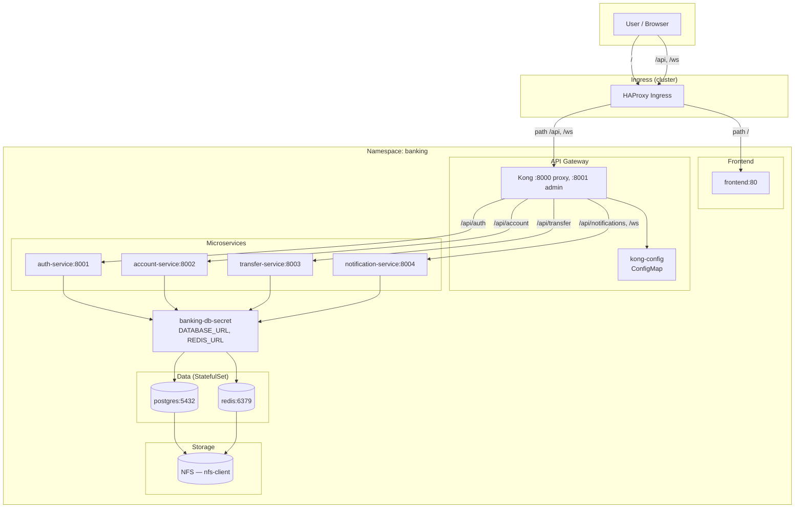

# Kiến trúc Giai đoạn 1 — Docker sang Kubernetes

Tài liệu mô tả luồng traffic và các thành phần trong **phase1-docker-to-k8s** (namespace `banking`).

---

## Sơ đồ tổng quan

---

## Luồng traffic

| Nguồn            | Ingress path | Backend           | Ghi chú                          |
|------------------|-------------|-------------------|----------------------------------|
| User             | `/`         | **frontend:80**   | Giao diện web (React/SPA)        |
| User / Frontend  | `/api/*`    | **Kong:8000**     | Kong route tới từng service      |
| User / Frontend  | `/ws`       | **Kong:8000**     | WebSocket → notification-service |

**Kong routing (trong ConfigMap `kong-config`):**

| Path / route    | Upstream service        | Port |
|-----------------|-------------------------|------|
| `/api/auth`     | auth-service            | 8001 |
| `/api/account`  | account-service         | 8002 |
| `/api/transfer` | transfer-service        | 8003 |
| `/api/notifications` | notification-service | 8004 |
| `/ws`           | notification-service    | 8004 |

---

## Thành phần Kubernetes

| Thành phần        | Loại          | Ghi chú |
|-------------------|---------------|--------|
| **postgres**      | StatefulSet   | 1 replica, Headless Service, PVC `pgdata-*` (StorageClass: nfs-client) |
| **redis**         | StatefulSet   | 1 replica, Headless Service, PVC `redis-data-*` (StorageClass: nfs-client) |
| **kong**          | Deployment    | 1 replica, đọc config từ ConfigMap `kong-config` |
| **auth-service**  | Deployment    | 1 replica, dùng Secret cho DB/Redis |
| **account-service** | Deployment  | 1 replica |
| **transfer-service** | Deployment | 1 replica |
| **notification-service** | Deployment | 1 replica |
| **frontend**      | Deployment    | 1 replica, phục vụ static trên port 80 |
| **Ingress**       | Ingress       | `ingressClassName: haproxy`, path-based |

---

## Phụ thuộc (dependency)

- **Postgres, Redis** → cần có trước khi các service ứng dụng start (đọc DATABASE_URL, REDIS_URL từ Secret).
- **Kong** → cần ConfigMap `kong-config`; các upstream (auth, account, transfer, notification) phải có Service trong cùng namespace.
- **Ingress** → cluster phải có HAProxy Ingress Controller; backend Services phải tồn tại.

---

## Lưu trữ (Storage)

- **Postgres**: Volume từ `volumeClaimTemplates` (pgdata), mount tại `/var/lib/postgresql/data`, **StorageClass: nfs-client**.
- **Redis**: Volume từ `volumeClaimTemplates` (redis-data), mount tại `/data`, **StorageClass: nfs-client**.
- Cả hai dùng NFS (NFS server + NFS subdir provisioner, StorageClass `nfs-client`).

Sơ đồ trên có thể xem bằng công cụ hỗ trợ Mermaid (GitHub, GitLab, VS Code với extension Mermaid, hoặc https://mermaid.live ).
