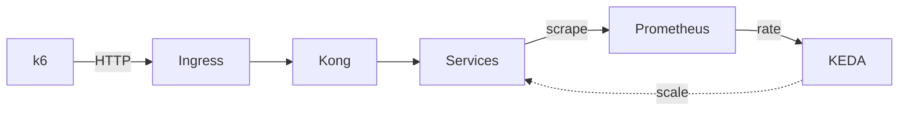
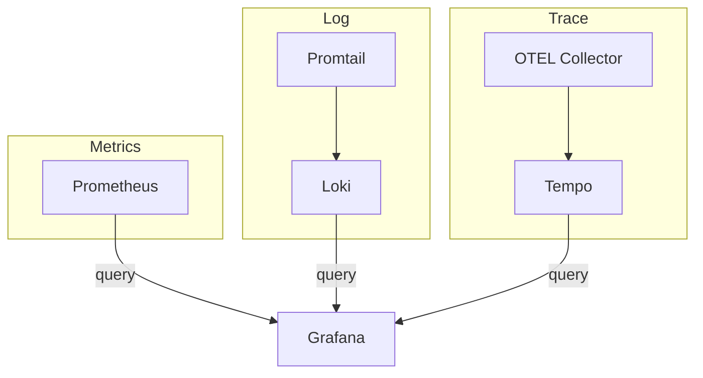

# Sơ đồ luồng Phase 3 — Monitoring, Logging, Tracing, KEDA

## Draw.io

Mở **`phase3-flow.drawio`** bằng [draw.io](https://app.diagrams.net/). Sơ đồ chia **3 phần**:

1. **Luồng request:** k6 → Ingress → Kong → Services  
2. **Observability:** 3 cột — **Metrics** (Prometheus, KEDA), **Log** (Promtail → Loki), **Trace** (OTEL → Tempo)  
3. **Visualization:** Grafana query Prometheus, Loki, Tempo  

---

## Mermaid — từng phần (dễ đọc)

### A. Luồng request + KEDA scale

```
k6 --HTTP--> Ingress --> Kong --> Services
Prometheus --scrape /metrics-- Services
KEDA --rate(http_requests_total)-- Prometheus
KEDA -.scale replicas.-> Services
```



### B. Observability → Grafana



- **Metrics:** Services expose `/metrics` → Prometheus scrape.  
- **Log:** Promtail thu log pod → gửi Loki.  
- **Trace:** App gửi OTLP → OTEL Collector → Tempo.  
- **Grafana:** datasource Prometheus, Loki, Tempo.

---

## Tóm tắt luồng

| Luồng | Nguồn | Đích |
|-------|-------|------|
| **HTTP** | k6 | Ingress → Kong → Services |
| **Metrics** | Services | Prometheus (scrape `/metrics`) |
| **KEDA** | Prometheus | KEDA query → scale Services |
| **Log** | Pods | Promtail → Loki |
| **Trace** | Services | OTEL Collector → Tempo |
| **Viz** | Prom, Loki, Tempo | Grafana (query) |
