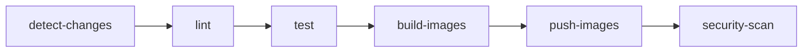
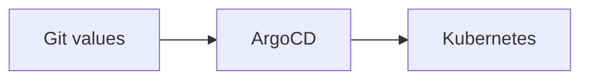

# CI/CD Flow — Phase 4

Luồng **CI** (GitHub Actions) và **CD** (ArgoCD) cho banking-demo v2.

---

## Tổng quan

```
Code push/PR  →  CI (GitHub Actions)  →  Push images  →  Git (values)  →  CD (ArgoCD sync)
```

| Giai đoạn | Công cụ | Chức năng |
|-----------|---------|-----------|
| **CI** | GitHub Actions | Lint → Test → Build images → Push lên GitLab Registry |
| **CD** | ArgoCD | Đọc Helm values từ Git → Deploy lên Kubernetes |

---

## CI — GitHub Actions

### Trigger

| Event | Điều kiện |
|-------|-----------|
| **Push** | `main`, `develop` — chỉ khi path thay đổi |
| **Pull Request** | `main` — chỉ khi path thay đổi |
| **Manual** | `workflow_dispatch` — chọn services, skip tests, force push |

### Path filters (chỉ chạy khi có thay đổi)

- `common/**`, `services/**`, `frontend/**`
- `phase4-application-v2/**`
- `.github/workflows/ci.yml`

**Không trigger** khi chỉ đổi: `phase2-helm-chart/**`, `phase3-monitoring-keda/**`, `*.md`

### Jobs (theo thứ tự)



| Job | Mô tả |
|-----|-------|
| **detect-changes** | Phát hiện services thay đổi (paths-filter); nếu `common` đổi → build all |
| **lint** | `ruff check` trên Python (v1 + v2) |
| **test** | `pytest` (v2), syntax check |
| **build-images** | Build Docker images (chỉ services thay đổi), output artifact |
| **push-images** | Push lên GitLab Registry — chỉ chạy trên `main`/`develop` (hoặc force từ manual) |
| **security-scan** | Trivy scan images (continue-on-error) |

### Manual trigger (workflow_dispatch)

| Input | Mô tả |
|-------|-------|
| `services` | `all`, hoặc chọn từng service (auth, account, transfer, notification, frontend) |
| `skip_tests` | Bỏ qua stage test (cho hotfix) |
| `force_push` | Push images kể cả khi không phải `main` |

### Secrets (GitHub)

| Secret | Mô tả |
|--------|-------|
| `GITLAB_USERNAME` | Username GitLab |
| `GITLAB_TOKEN` | Personal Access Token (read_registry, write_registry) |

### Image tags

- `sha:<7 ký tự>` (vd: `abc1234`)
- `branch` (vd: `main`, `develop`)
- `latest` (chỉ khi push lên `main`)

---

## CD — ArgoCD

### Luồng

1. CI push images lên GitLab Registry (tag = commit SHA)
2. Dev sửa `image.tag` trong `charts/*/values.yaml` thành SHA
3. Commit + push lên Git
4. ArgoCD sync (đọc Git → Helm upgrade)



### Selective sync (tránh restart postgres/redis)

- **Cách 1**: ArgoCD UI → Selective Sync → Chọn chỉ Deployments (auth, account, transfer, notification, frontend)
- **Cách 2**: Per-service Applications — chỉ sync 5 app, không sync postgres/redis

---

## Tóm tắt luồng

| Bước | Hành động |
|------|-----------|
| 1 | Push code → CI chạy (lint, test, build, push) |
| 2 | Lấy commit SHA từ GitHub Actions |
| 3 | Sửa `image.tag` trong 5 file values (auth, account, transfer, notification, frontend) |
| 4 | Commit + push → ArgoCD sync (chỉ 5 app) |
| 5 | Verify + smoke test |

---

## Tham chiếu

- `phase4-application-v2/README.md` — Hướng dẫn chi tiết từng bước
- `.github/workflows/ci.yml` — Định nghĩa CI
- `phase2-helm-chart/argocd/ARGOCD.md` — Hướng dẫn ArgoCD đầy đủ
