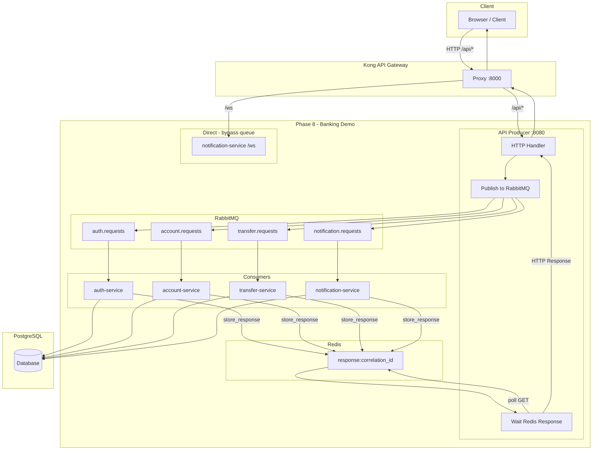

# Phase 8 — Kong → API Producer → RabbitMQ → Consumers

Kiến trúc: Kong nhận HTTP → API Producer publish → RabbitMQ → Consumers (auth, account, transfer, notification) → Response qua Redis.

## Luồng

1. **Kong** route `/api/*` → api-producer:8080, `/ws` → notification-service:8004
2. **API Producer** nhận HTTP, map path → queue, publish → RabbitMQ, chờ response qua Redis
3. **Consumers** (auth, account, transfer, notification) consume từ queue, xử lý, ghi response vào Redis
4. **Producer** đọc response từ Redis, trả HTTP cho client


## Queues

- `auth.requests` — register, login
- `account.requests` — me, balance, lookup, admin/*
- `transfer.requests` — transfer
- `notification.requests` — GET /notifications

WebSocket `/ws` đi trực tiếp tới notification-service (không qua queue).

## Triển khai RabbitMQ

RabbitMQ triển khai **riêng** trên namespace `rabbit`. Credentials lưu trong **Secret riêng**, **không** ghi vào values file.

### 1. Namespace và Secret cho RabbitMQ (ns `rabbit`)

```bash
kubectl create namespace rabbit

# Secret — tạo thủ công, KHÔNG commit vào git
kubectl create secret generic rabbitmq-secret \
  --from-literal=rabbitmq-username=banking \
  --from-literal=rabbitmq-password='<PASSWORD>' \
  -n rabbit
```

### 2. Cài đặt RabbitMQ

**Option A — Official image** (khuyến nghị khi Bitnami ImagePullBackOff):

```bash
kubectl apply -f phase8-application-v3/rabbitmq/k8s-rabbitmq-standalone.yaml
```

Dùng image `rabbitmq:3.12-management`, persistence với StorageClass `nfs-client` (8Gi).

**Option B — Bitnami Legacy** (image tại `bitnamilegacy/rabbitmq`, không còn cập nhật):

```bash
helm repo add bitnami https://charts.bitnami.com/bitnami
helm repo update

helm install rabbitmq bitnami/rabbitmq -n rabbit -f - <<EOF
image:
  registry: docker.io
  repository: bitnamilegacy/rabbitmq
  tag: 3.10.12-debian-11-r4

auth:
  username: banking
  existingPasswordSecret: "rabbitmq-secret"
  existingSecretPasswordKey: "rabbitmq-password"

replicaCount: 3
clustering:
  enabled: true
  rebalance: true

persistence:
  enabled: true
  storageClass: "nfs-client"
  size: 8Gi

metrics:
  enabled: true
EOF
```

**Option C — Bitnami mới (OCI):** Nếu `bitnami/rabbitmq` pull được:

```bash
helm install rabbitmq oci://registry-1.docker.io/bitnamicharts/rabbitmq -n rabbit -f - <<EOF
auth:
  username: banking
  existingPasswordSecret: "rabbitmq-secret"
  existingSecretPasswordKey: "rabbitmq-password"

replicaCount: 3
clustering:
  enabled: true
  rebalance: true

persistence:
  enabled: true
  storageClass: "nfs-client"
  size: 8Gi

metrics:
  enabled: true
EOF
```

Nếu gặp `manifest unknown` / `ImagePullBackOff`, dùng Option A (official) hoặc Option B (legacy).

### 3. Secret connection cho banking-demo (ns `banking-demo`)

Producer và consumers đọc `RABBITMQ_URL` từ Secret `rabbitmq-connection-secret`. **Tạo thủ công**, không ghi vào values:

```bash
# Thay <PASSWORD> bằng password đã dùng ở bước 1
kubectl create secret generic rabbitmq-connection-secret \
  --from-literal=RABBITMQ_URL='amqp://banking:<PASSWORD>@rabbitmq.rabbit.svc.cluster.local:5672/' \
  -n banking-demo
```

Values-phase8.yaml chỉ khai báo `rabbitmqSecretRef.name` và `key`, không chứa URL hay password.


## Build và deploy

### Build images

```bash
# Build từ repo root
docker build -f phase8-application-v3/producer/Dockerfile . -t registry.gitlab.com/kiettt164/banking-demo-payment/api-producer:latest
docker build -f phase8-application-v3/services/auth-service/Dockerfile . -t registry.gitlab.com/.../auth-service:v3
docker build -f phase8-application-v3/services/account-service/Dockerfile . -t registry.gitlab.com/.../account-service:v3
docker build -f phase8-application-v3/services/transfer-service/Dockerfile . -t registry.gitlab.com/.../transfer-service:v3
docker build -f phase8-application-v3/services/notification-service/Dockerfile . -t registry.gitlab.com/.../notification-service:v3
```

### Deploy banking-demo

**Lưu ý:** RabbitMQ deploy riêng ns `rabbit`. Trước khi deploy banking-demo, tạo Secret `rabbitmq-connection-secret` trong ns `banking-demo` (xem mục Triển khai RabbitMQ).

```bash
cd phase2-helm-chart/banking-demo
# values-phase8.yaml PHẢI đặt cuối
helm upgrade --install banking-demo . -n banking-demo \
  -f charts/common/values.yaml \
  -f charts/auth-service/values.yaml \
  -f charts/account-service/values.yaml \
  -f charts/transfer-service/values.yaml \
  -f charts/notification-service/values.yaml \
  -f charts/api-producer/values.yaml \
  -f charts/kong/values.yaml \
  -f charts/frontend/values.yaml \
  -f values-phase8.yaml
```

**Lưu ý:** Phase 8 cần override image tag cho auth/account/transfer/notification sang v3 khi deploy. Thêm vào values-phase8.yaml hoặc dùng `--set`:

```bash
--set auth-service.image.tag=v3 \
--set account-service.image.tag=v3 \
--set transfer-service.image.tag=v3 \
--set notification-service.image.tag=v3
```

### Rollback về Phase 2/4

```bash
helm upgrade banking-demo . -n banking-demo -f charts/common/values.yaml -f charts/auth-service/values.yaml ...
# (không dùng values-phase8.yaml)
```

## Cấu trúc

- `common/` — db, models, redis, rabbitmq_utils, health_server
- `producer/` — FastAPI nhận HTTP, publish/wait
- `services/auth-service/` — consumer auth.requests
- `services/account-service/` — consumer account.requests
- `services/transfer-service/` — consumer transfer.requests
- `services/notification-service/` — consumer + WebSocket /ws
