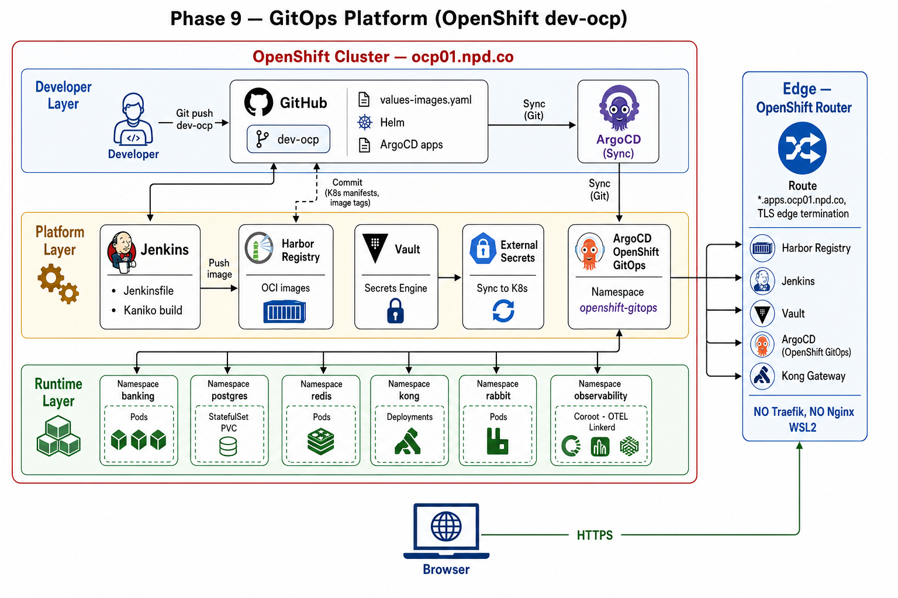

# Phase 9 — Kiến trúc OpenShift (dev-ocp)

OpenShift expose service bằng **Route** (HAProxy Router built-in) — không dùng Traefik Ingress hay Nginx bên ngoài.

## Sơ đồ tổng thể



Nguồn Mermaid: [`phase9-architecture-overview-ocp.mmd`](../articles/viblo-series/assets/phase9-architecture-overview-ocp.mmd)

## Edge / Routing

| | dev-ocp |
|---|---------|
| **TLS** | OpenShift Router terminate HTTPS (edge) |
| **Routing** | **Route** `route.openshift.io/v1` |
| **Domain apps** | `*.apps.ocp01.npd.co` |
| **Banking** | `npd-banking.co` (DNS → Router) |
| **ArgoCD** | NS `argocd`, Route `argocd-server` |
| **Storage** | NFS CSI `nfs-csi` |

## Luồng request (runtime)

```text
Browser / oc
    │
    ▼
OpenShift Router (HAProxy) — TLS edge
    │
    ├── harbor-banking.apps.ocp01.npd.co     → Harbor (ns platform)
    ├── jenkins-platform.apps.ocp01.npd.co → Jenkins (ns platform)
    ├── vault-banking.apps.ocp01.npd.co      → Vault (ns vault)
    ├── argocd-server-argocd.apps...       → ArgoCD UI
    ├── kong.apps.ocp01.npd.co               → Kong proxy (ns kong)
    └── npd-banking.co                       → frontend + /api,/ws → Kong (ns banking)
```

## Luồng CI/CD

```text
Git push dev-ocp
    → Jenkins (Multibranch, branch dev-ocp)
    → Kaniko build in-cluster
    → push harbor-banking.apps.ocp01.npd.co/banking-demo/<svc>:<sha>
    → commit phase9-gitops-platform/gitops/values-images.yaml
    → ArgoCD sync banking apps
```

## Mermaid

```mermaid
flowchart TB
  subgraph DEV["Developer"]
    GH["GitHub dev-ocp"]
    DEV["Git push"] --> GH
  end

  subgraph OCP["OpenShift Cluster"]
    JEN[Jenkins + Kaniko]
    HAR[Harbor]
    ARGO[ArgoCD]
    RT["OpenShift Router\n*.apps.ocp01.npd.co"]

    GH --> JEN
    JEN --> HAR
    JEN -->|commit values-images| GH
    GH --> ARGO
    RT --> HAR & JEN & ARGO
  end

  USER[Browser] --> RT
```

Triển khai: [OCP-DEPLOY-GUIDE.md](./OCP-DEPLOY-GUIDE.md)
