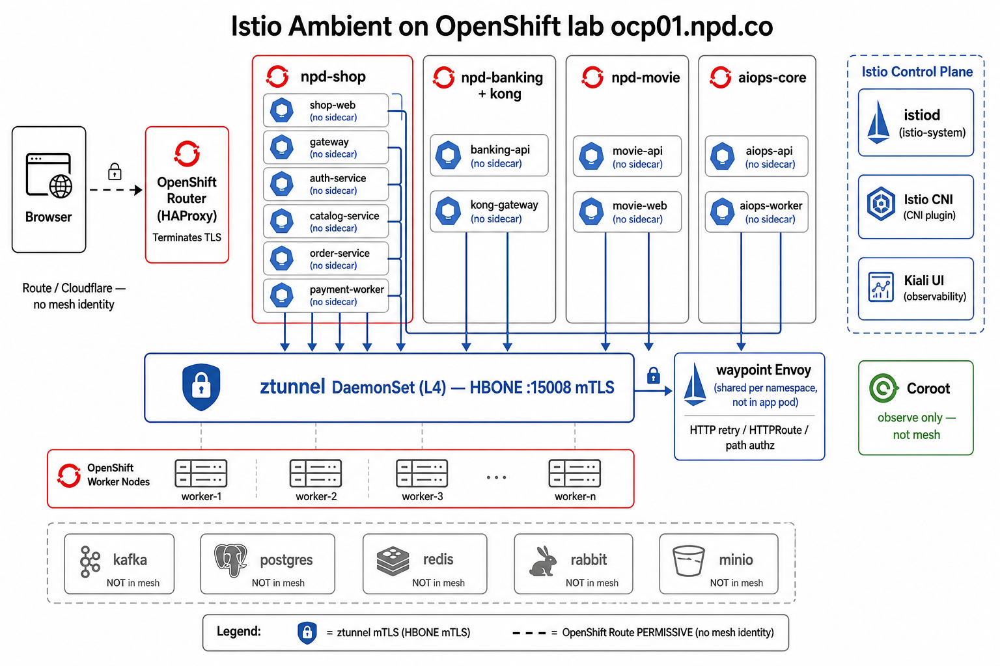
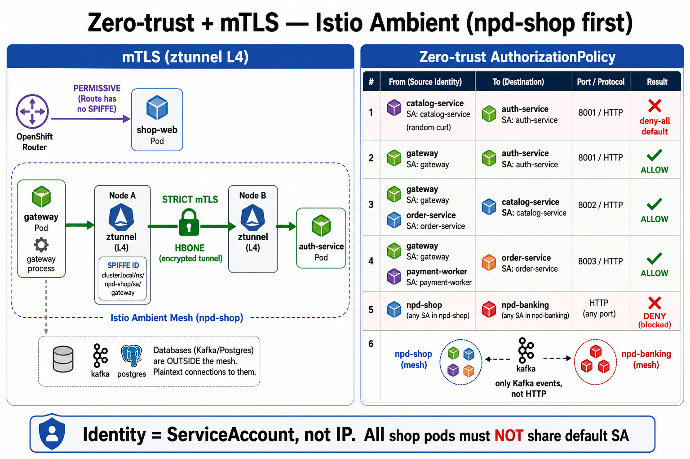
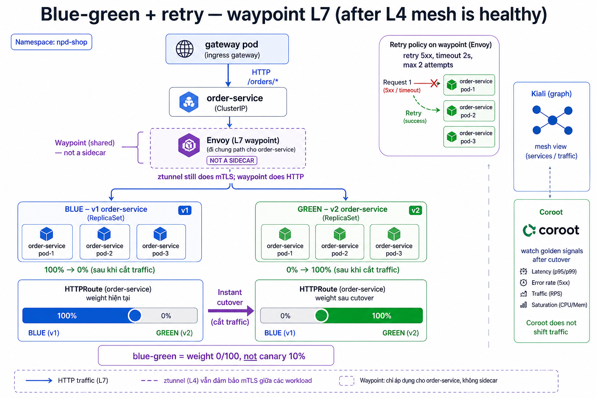

# Istio Ambient (sidecar-less) + zero-trust — GitOps trên OCP lab

Hướng dẫn **end-to-end** cài **OpenShift Service Mesh 3 (OSSM 3)** chế độ **Istio Ambient**: không sidecar trong pod app, mTLS / policy / retry / blue-green. Coroot **không** thay mesh — chỉ quan sát.

Cluster: **ocp01.npd.co** (OCP 4.20). ArgoCD: ns `argocd`. Nhánh Git platform: **`dev-ocp`**.

| | |
|--|--|
| Mesh | OSSM 3 Sail Operator — `profile: ambient` (ztunnel L4 + waypoint L7 tùy chọn) |
| UI | Kiali (không dùng Linkerd Viz) |
| Observability | Coroot + OTEL — giữ nguyên Giai đoạn 2b |
| GitOps | App of Apps, cùng kiểu `observability-app-of-apps-dev-ocp` |
| Linkerd | **Đã gỡ trên cụm — không cài lại, không sync app Linkerd** |

Tài liệu liên quan:

- [OCP-DEPLOY-GUIDE.md](../../OCP-DEPLOY-GUIDE.md) — Giai đoạn 2c (sau 2b Observability)
- [README.md](./README.md) — thứ tự apply env `dev-ocp`
- OSSM 3 Ambient (Red Hat): [Installing Istio ambient mode](https://docs.redhat.com/en/documentation/red_hat_openshift_service_mesh/3.4/html/installing/ossm-istio-ambient-mode)

> **Trạng thái repo:** Đây là **runbook**. Cây `mesh/` và Application `mesh-app-of-apps-dev-ocp` **chưa** commit — copy YAML trong từng mục vào Git rồi mới `oc apply`. Trên cluster: xác nhận GVK (`oc api-resources | grep -iE 'istio|ztunnel|sail'`), vì bản OSSM 3.x có thể lệch `sailoperator.io` vs field `trustedZtunnelNamespace`.

---

## 0. Đọc trước — phạm vi lab

### 0.1. Bốn product, một control plane

```text
Browser / Cloudflare Tunnel
        │  TLS terminate (Route / cloudflared) — không có identity mesh
        ▼
┌───────────────┐   ┌───────────────┐   ┌───────────────┐   ┌─────────────────┐
│ npd-banking   │   │ npd-shop      │   │ npd-movie    │   │ aiops-core       │
│ + kong        │   │ gateway → svc │   │ web → api    │   │ incident / RCA   │
│ shop-bridge   │   │               │   │ media-worker│   │                  │
└───────┬───────┘   └───────┬───────┘   └───────┬───────┘   └────────┬────────┘
        │ Kafka             │ Kafka            │ MinIO            │ query
        ▼                   ▼                   ▼                   ▼
     ns kafka            ns kafka            ns minio      Prometheus / Coroot
     postgres / redis / rabbit                                 ns postgres (DB aiops)
```

**Một** Istio Ambient cho cả cluster. Zero-trust = **allow-list riêng từng namespace**, không phải “mọi service trong mesh nói chuyện được với nhau”.



*Pod app không sidecar. Traffic xuống ztunnel (L4, HBONE). L7 (retry / HTTPRoute) qua waypoint Envoy dùng chung namespace. Coroot chỉ quan sát. `kafka` / `postgres` / `redis` / `rabbit` / `minio` không enroll.*

HTTP xuyên product **gần như không có**:

| Luồng | Cách thật trên lab | Mesh? |
|-------|-------------------|--------|
| Shop checkout → ngân hàng | Kafka `orders.events` → `shop-bridge` (ns `npd-banking`) → `payments.events` | Kafka **không** enroll |
| Movie | Cô lập (Postgres + Redis + MinIO) | Chỉ ns `npd-movie` |
| AIOps | Alertmanager webhook + đọc Prometheus/Coroot/K8s API | **Không** gọi API banking/shop/movie |

### 0.2. Ambient là gì (không sidecar trong pod app)

```text
App container (không sidecar)
        │
        ▼
ztunnel  (DaemonSet / node)     ← L4: mTLS, identity SPIFFE, policy cổng
        │  HBONE :15008
        ▼
waypoint (Envoy, tùy chọn)      ← L7: retry, HTTPRoute weight, path authz
```

- Join mesh: **label namespace** — không inject, không bắt buộc restart pod.
- Retry / blue-green HTTP / policy theo path: cần **waypoint** (Envoy dùng chung ns, vẫn không nằm trong pod app).
- OpenShift **Route** và **cloudflared** không có identity Istio. STRICT mTLS trên workload nhận traffic từ Route/tunnel sẽ **cắt** HTTPS công khai nếu không PERMISSIVE / exclude.

### 0.3. Ai vào mesh, ai không

| Namespace | Ambient? | Ghi chú |
|----------|----------|---------|
| `npd-shop` | **Có — làm trước** | Gateway HTTP → 4 service; Kiali ra graph ngay |
| `npd-banking`, `kong` | Có — đợt 2 | PERMISSIVE frontend + Kong (Route) |
| `npd-movie` | Có — đợt 3 | **Exclude** `cloudflared` |
| `aiops-core` | Có — đợt 4, cẩn thận | PERMISSIVE cổng webhook |
| `aiops-observability` | Tùy | Grafana Route = PERMISSIVE |
| `aiops-automation` | **Chưa** | Remediation write — RBAC, không mesh |
| `kafka`, `postgres`, `redis`, `rabbit`, `minio` | **Không** | TCP/AMQP/SQL; NetworkPolicy |
| `observability` (Coroot) | Không (lúc đầu) | OTLP ra ngoài mesh được |
| `openshift-*`, `argocd`, `vault`, `platform` | **Không** | `discoverySelectors` chặn istiod ôm ns này |

### 0.4. Thứ tự bắt buộc (không đảo)

| Đợt | Việc | Repo Git |
|------|--------|----------|
| **A** | OVN local gateway — **tay, 1 lần** | Không GitOps |
| **B** | Operator + Istio + CNI + ztunnel + Kiali | `banking-demo` `dev-ocp` |
| **C** | Enroll `npd-shop` (chưa STRICT) | `npd-shop` |
| **D** | SA + STRICT + deny-all shop | `npd-shop` |
| **E** | Banking + Kong | `banking-demo` |
| **F** | Movie (exclude cloudflared) | `movie-web` |
| **G** | `aiops-core` | `Open-Source-AIOps-Platform` |
| **H** | Waypoint + retry / blue-green | Sau khi D ổn |

> **Không** enroll bốn product cùng ngày. **Không** bật STRICT + deny-all trước khi Kiali thấy traffic.

Helm/chart hiện tại nhiều Deployment **không** set `serviceAccountName` → mọi pod = SA `default`. Policy “chỉ gateway gọi auth” **không phân biệt** được service. Phải tạo SA **trước** bước STRICT.

---

## 1. Điều kiện tiên quyết

| Hạng mục | Yêu cầu |
|----------|---------|
| OCP | **4.19+** (lab **4.20**) |
| CNI | **OVN-Kubernetes** |
| OSSM | Operator **3.1+** (nên **3.3 / 3.4**). **Không** cài OSSM 2.x cùng cluster |
| Gateway API CRD | Có sẵn trên OCP 4.19+ |
| Quyền | `cluster-admin` (OVN, OLM, SCC) |
| Linkerd | Đã xóa; Argo **không** còn sync `observability-linkerd-*` |
| App đang chạy | Shop / banking / movie nên **Running** trước khi enroll (dễ so sánh trước/sau) |

### 1.1. Kiểm tra cụm

```bash
oc whoami
oc get nodes
oc get network.operator cluster -o jsonpath='{.spec.defaultNetwork.type}{"\n"}'
# Kỳ vọng: OVNKubernetes

oc get crd gateways.gateway.networking.k8s.io
oc get ns | grep -E 'linkerd|istio|ztunnel'
oc get application -n argocd | grep -i linkerd
```

Nếu còn Application Linkerd: xóa hoặc suspend — **không** để Argo cài lại.

```bash
# Ví dụ — chỉ khi app còn tồn tại
oc delete application -n argocd -l app.kubernetes.io/component=linkerd --ignore-not-found
```

---

## 2. Đợt A — OVN local gateway (tay, không GitOps)

Ambient trên OCP **bắt buộc** OVN **local gateway**: `routingViaHost: true`. Đổi xong OVN rolling worker — **downtime mạng ngắn**.

**Không** để ArgoCD quản lý `network.operator` (self-heal rất nguy hiểm).

```bash
oc patch network.operator cluster --type=merge -p '{
  "spec": {
    "defaultNetwork": {
      "ovnKubernetesConfig": {
        "gatewayConfig": {
          "routingViaHost": true
        }
      }
    }
  }
}'

oc get network.operator cluster \
  -o jsonpath='{.spec.defaultNetwork.ovnKubernetesConfig.gatewayConfig.routingViaHost}{"\n"}'
# Kỳ vọng: true
```

Chờ OVN ổn:

```bash
oc get pods -n openshift-ovn-kubernetes -o wide
oc get mcp
# workers Updated=True, Updating=False
```

**Checkpoint A:** `routingViaHost=true`; pod OVN Running; ping/DNS nội bộ OK; Route shop/banking vẫn mở được.

Ghi chú vào runbook lab: lệnh patch đã chạy ngày nào. Không commit patch này vào Git.

---

## 3. Đợt B — GitOps control plane (repo `banking-demo`)

Cùng pattern `observability-app-of-apps-dev-ocp`. Mesh **tách** khỏi Coroot/OTEL.

### 3.1. Cây thư mục cần tạo

```text
phase9-gitops-platform/
  mesh/
    operator/
      subscription.yaml            # servicemeshoperator3 + kiali-ossm
    control-plane/
      namespaces.yaml              # istio-system, istio-cni, ztunnel + labels
      istio.yaml
      istio-cni.yaml
      ztunnel.yaml
    kiali/
      kiali.yaml
      route.yaml                   # kiali-platform.apps.ocp01.npd.co
  gitops-platform/applications/mesh/
    operator.yaml                  # wave 0
    istio.yaml                     # wave 1
    istio-cni.yaml                 # wave 1
    ztunnel.yaml                   # wave 2
    kiali.yaml                     # wave 3
  environments/dev-ocp/argocd/applications/
    mesh-app-of-apps.yaml
```

Policy **shop/movie/aiops không** để trong repo banking. Control plane một chỗ; allow-list đi theo AppProject từng product.

### 3.2. AppProject `banking-platform`

Sửa `environments/dev-ocp/appproject.yaml`:

**Destinations** thêm:

```yaml
    - namespace: istio-system
      server: https://kubernetes.default.svc
    - namespace: istio-cni
      server: https://kubernetes.default.svc
    - namespace: ztunnel
      server: https://kubernetes.default.svc
    - namespace: kiali
      server: https://kubernetes.default.svc
```

(`openshift-operators` đã có.)

**clusterResourceWhitelist** thêm:

```yaml
    - group: operators.coreos.com
      kind: Subscription
    - group: operators.coreos.com
      kind: OperatorGroup
    - group: sailoperator.io
      kind: "*"
    - group: networking.istio.io
      kind: "*"
    - group: security.istio.io
      kind: "*"
    - group: telemetry.istio.io
      kind: "*"
    - group: gateway.networking.k8s.io
      kind: "*"
    - group: kiali.io
      kind: "*"
```

```bash
oc apply -f phase9-gitops-platform/environments/dev-ocp/appproject.yaml -n argocd
```

ArgoCD **ignoreDifferences** cho Subscription OLM (OLM ghi `status` / `startingCSV`) — nếu Argo OutOfSync liên tục, thêm vào ConfigMap `argocd-cm` hoặc `spec.ignoreDifferences` trên Application operator.

### 3.3. Operator (wave 0)

OLM: Subscription tạo xong **chưa** nghĩa là CRD sẵn. Wave 0 (operator) phải Ready trước wave 1 (Istio CR). Application Istio: `syncOptions: SkipDryRunOnMissingResource=true`.

`mesh/operator/subscription.yaml`:

```yaml
apiVersion: operators.coreos.com/v1alpha1
kind: Subscription
metadata:
  name: openshift-service-mesh-3
  namespace: openshift-operators
  annotations:
    argocd.argoproj.io/sync-wave: "0"
spec:
  channel: stable
  installPlanApproval: Automatic
  name: servicemeshoperator3
  source: redhat-operators
  sourceNamespace: openshift-marketplace
---
apiVersion: operators.coreos.com/v1alpha1
kind: Subscription
metadata:
  name: kiali-ossm
  namespace: openshift-operators
  annotations:
    argocd.argoproj.io/sync-wave: "0"
spec:
  channel: stable
  installPlanApproval: Automatic
  name: kiali-ossm
  source: redhat-operators
  sourceNamespace: openshift-marketplace
```

`openshift-operators` thường **đã có** OperatorGroup (all namespaces). **Không** tạo OperatorGroup thứ hai trong ns đó.

```bash
oc get csv -n openshift-operators | grep -iE 'mesh|kiali|sail'
# Chờ Succeeded
```

### 3.4. Namespaces control plane

Label `istio-discovery=enabled` bắt buộc nếu dùng `discoverySelectors` (mục 3.5). Thiếu label → istiod **không** thấy ztunnel/CNI.

```yaml
apiVersion: v1
kind: Namespace
metadata:
  name: istio-system
  labels:
    istio-discovery: enabled
    pod-security.kubernetes.io/enforce: privileged
---
apiVersion: v1
kind: Namespace
metadata:
  name: istio-cni
  labels:
    istio-discovery: enabled
    pod-security.kubernetes.io/enforce: privileged
---
apiVersion: v1
kind: Namespace
metadata:
  name: ztunnel
  labels:
    istio-discovery: enabled
    pod-security.kubernetes.io/enforce: privileged
```

CNI + ztunnel cần privileged / hostNetwork — giống node-agent. Nếu pod `Forbidden`, gán SCC:

```bash
oc adm policy add-scc-to-group privileged system:serviceaccounts:istio-cni
oc adm policy add-scc-to-group privileged system:serviceaccounts:ztunnel
```

### 3.5. Istio CR — `profile: ambient`

Tên ns `ztunnel` **phải** trùng `spec.values.pilot.trustedZtunnelNamespace`.

RHCOS 10 / RHEL 10: thêm `values.global.nativeNftables: true` (docs Red Hat). Lab OCP 4.20 RHCOS: bật nếu ztunnel không redirect được.

```yaml
apiVersion: sailoperator.io/v1
kind: Istio
metadata:
  name: default
spec:
  namespace: istio-system
  profile: ambient
  values:
    pilot:
      trustedZtunnelNamespace: ztunnel
    meshConfig:
      discoverySelectors:
        - matchLabels:
            istio-discovery: enabled
```

```yaml
apiVersion: sailoperator.io/v1
kind: IstioCNI
metadata:
  name: default
spec:
  namespace: istio-cni
  profile: ambient
```

```yaml
# Xác nhận GVK trên cluster: oc api-resources | grep -i ztunnel
apiVersion: sailoperator.io/v1alpha1
kind: ZTunnel
metadata:
  name: default
spec:
  namespace: ztunnel
  profile: ambient
```

### 3.6. App of Apps

`environments/dev-ocp/argocd/applications/mesh-app-of-apps.yaml`:

```yaml
apiVersion: argoproj.io/v1alpha1
kind: Application
metadata:
  name: mesh-app-of-apps-dev-ocp
  namespace: argocd
  labels:
    app.kubernetes.io/part-of: phase9-gitops
    banking-demo/environment: dev-ocp
  annotations:
    argocd.argoproj.io/sync-wave: "1"
spec:
  project: banking-platform
  source:
    repoURL: https://github.com/kevinram164/banking-demo.git
    targetRevision: dev-ocp
    path: phase9-gitops-platform/gitops-platform/applications/mesh
    directory:
      recurse: false
  destination:
    server: https://kubernetes.default.svc
    namespace: argocd
  syncPolicy:
    syncOptions:
      - CreateNamespace=true
    automated:
      prune: false
      selfHeal: true
```

Child Application Istio/CNI/ztunnel: `syncOptions` gồm `SkipDryRunOnMissingResource=true`.

### 3.7. Apply và chờ

```bash
# Push Git nhánh dev-ocp trước
oc apply -f phase9-gitops-platform/environments/dev-ocp/argocd/applications/mesh-app-of-apps.yaml

# Operator
oc get csv -n openshift-operators | grep -iE 'servicemesh|kiali'

# Control plane
oc wait --for=condition=Ready istios/default --timeout=5m
oc wait --for=condition=Ready istiocnis/default --timeout=5m
oc wait --for=condition=Ready ztunnels/default --timeout=5m

oc get pods -n istio-system
oc get pods -n istio-cni -o wide
oc get ds -n ztunnel
oc get pods -n ztunnel -o wide
```

Kiali + Route (ví dụ):

```yaml
apiVersion: kiali.io/v1alpha1
kind: Kiali
metadata:
  name: kiali
  namespace: kiali
spec:
  deployment:
    accessible_namespaces:
      - "**"
  istio_namespace: istio-system
```

Route: host `kiali-platform.apps.ocp01.npd.co` → Service Kiali (port UI, thường 20001).

**Checkpoint B:**

| Lệnh | Kỳ vọng |
|------|---------|
| `oc get csv -n openshift-operators` | Sail + Kiali `Succeeded` |
| `oc get istio,istiocni,ztunnel` | Ready |
| DS ztunnel | 1 pod / worker, Running |
| Kiali Route | Mở được UI, chưa có app graph (chưa enroll) |

---

## 4. Đợt C — Enroll `npd-shop` (chưa STRICT)

Shop enroll **trước** banking: gateway HTTP fan-out, Kiali có graph ngay.

### 4.1. GitOps — repo `npd-shop`

Không nhét CR Istio vào Helm chart shop. Application **thứ hai**:

```text
npd-shop/deploy/mesh/
  kustomization.yaml
  namespace.yaml              # merge labels
  # policy — Đợt D
deploy/argocd/npd-shop-mesh.yaml
```

`namespace.yaml` (Server-Side Apply, chỉ patch label — **không** xóa label OpenShift):

```yaml
apiVersion: v1
kind: Namespace
metadata:
  name: npd-shop
  labels:
    istio-discovery: enabled
    istio.io/dataplane-mode: ambient
```

AppProject `npd-shop-platform` — `namespaceResourceWhitelist` đã `*/*` thì đủ cho `PeerAuthentication` / `AuthorizationPolicy`. Nếu sau này siết whitelist, thêm `security.istio.io`.

`deploy/argocd/npd-shop-mesh.yaml`:

```yaml
apiVersion: argoproj.io/v1alpha1
kind: Application
metadata:
  name: npd-shop-mesh
  namespace: argocd
  annotations:
    argocd.argoproj.io/sync-wave: "4"
spec:
  project: npd-shop-platform
  source:
    repoURL: https://github.com/kevinram164/npd-shop.git
    targetRevision: main
    path: deploy/mesh
  destination:
    server: https://kubernetes.default.svc
    namespace: npd-shop
  syncPolicy:
    syncOptions:
      - ServerSideApply=true
    automated:
      prune: false
      selfHeal: true
```

```bash
oc apply -f deploy/argocd/npd-shop-mesh.yaml -n argocd
oc get ns npd-shop --show-labels
# Phải có: istio.io/dataplane-mode=ambient, istio-discovery=enabled
```

Ambient **không** thêm container vào pod (`READY` vẫn `1/1`).

### 4.2. Xác nhận ztunnel đã nhận workload

```bash
# istioctl — cài từ bản OSSM/Istio tương ứng, hoặc:
oc exec -n istio-system deploy/istiod -- istioctl ztunnel-config workloads --namespace ztunnel 2>/dev/null | grep npd-shop
```

Cột `PROTOCOL` của pod shop ≈ `HBONE`. `WAYPOINT` = `None` (chưa waypoint).

### 4.3. Smoke — **trước** STRICT

```bash
curl -skI https://npd-shop.co/
curl -sk https://npd-shop.co/api/health
# Kiali → Graph → namespace npd-shop
# Coroot: latency/error không nhảy bất thường
```

**Checkpoint C:** Shop UI + API OK; Kiali thấy gateway → auth/catalog/order/payment; Coroot không báo error mới.

---

## 5. Đợt D — Zero-trust shop

Chỉ khi checkpoint C xanh.



*mTLS do ztunnel; identity = ServiceAccount (SPIFFE), không phải IP. East-west shop: STRICT. OpenShift Route vào shop-web/Kong: PERMISSIVE. Deny-all rồi ALLOW theo SA. Shop không HTTP sang banking — chỉ Kafka.*

### 5.1. ServiceAccount từng workload (bắt buộc)

Helm `charts/shop` hiện dễ dùng SA `default`. Thêm SA + `serviceAccountName` trên từng Deployment:

| Workload (values key) | Service | Port | SA đề xuất |
|------------------------|---------|------|------------|
| `shopWeb` | shop-web | 8080 | `shop-web` |
| `gateway` | gateway | 8080 | `gateway` |
| `authService` | auth-service | 8001 | `auth-service` |
| `catalogService` | catalog-service | 8002 | `catalog-service` |
| `orderService` | order-service | 8003 | `order-service` |
| `paymentWorker` | payment-worker | 8004 | `payment-worker` |

Sau khi đổi SA, rollout:

```bash
oc -n npd-shop get deploy -o jsonpath='{range .items[*]}{.metadata.name}{"\t"}{.spec.template.spec.serviceAccountName}{"\n"}{end}'
# Không còn trống / default (trừ Job seed nếu cố ý)
```

Identity SPIFFE: `cluster.local/ns/npd-shop/sa/<tên-sa>`.

### 5.2. PeerAuthentication

Default ns **STRICT**. Workload nhận **OpenShift Route** (thường `shop-web`, có khi `gateway` nếu Route trỏ thẳng): **PERMISSIVE** inbound.

```yaml
apiVersion: security.istio.io/v1
kind: PeerAuthentication
metadata:
  name: default
  namespace: npd-shop
spec:
  mtls:
    mode: STRICT
---
apiVersion: security.istio.io/v1
kind: PeerAuthentication
metadata:
  name: route-facing
  namespace: npd-shop
spec:
  selector:
    matchLabels:
      app: shop-web          # khớp label Deployment thật (oc get deploy -o yaml)
  mtls:
    mode: PERMISSIVE
```

Nếu Route trỏ `gateway` (không qua shop-web): thêm PA PERMISSIVE cho `app: gateway`.

### 5.3. Deny mặc định + allow-list

Empty `AuthorizationPolicy` = deny all trong namespace.

```yaml
apiVersion: security.istio.io/v1
kind: AuthorizationPolicy
metadata:
  name: deny-all
  namespace: npd-shop
spec: {}
```

ALLOW (L4 — chưa cần waypoint):

```yaml
apiVersion: security.istio.io/v1
kind: AuthorizationPolicy
metadata:
  name: allow-gateway-to-auth
  namespace: npd-shop
spec:
  selector:
    matchLabels:
      app: auth-service
  action: ALLOW
  rules:
    - from:
        - source:
            principals: ["cluster.local/ns/npd-shop/sa/gateway"]
      to:
        - operation:
            ports: ["8001"]
```

Lặp tương tự:

| Đích (selector) | Port | Source principal |
|-----------------|------|------------------|
| `catalog-service` | 8002 | `.../sa/gateway` **và** `.../sa/order-service` |
| `order-service` | 8003 | `.../sa/gateway`, `.../sa/payment-worker` |
| `payment-worker` | 8004 | `.../sa/gateway` |

**Không** allow principal từ `npd-banking`. Shop↔bank = Kafka, ns `kafka` không enroll.

Probe kubelet: Istio CNI rewrite. Nếu readiness fail sau enroll — xem mục 10.

### 5.4. Test deny

```bash
# Từ catalog — không được gọi auth
oc -n npd-shop debug deploy/catalog-service --image=curlimages/curl:8.11.0 -- \
  curl -sS -o /dev/null -w "%{http_code}" http://auth-service:8001/health
# Kỳ vọng: fail / denied — không 200 nghiệp vụ
```

Shop UI login / browse / checkout (không cần bank) vẫn OK.

**Checkpoint D:** STRICT nội bộ; Route vẫn vào được; deny cross-service; Kiali lock/mTLS trên east-west.

---

## 6. Đợt E — Banking + Kong

Repo `banking-demo`, nhánh `dev-ocp`. Application `banking-mesh` (Kustomize ns `npd-banking` + `kong`), **không** copy YAML shop.

### 6.1. Label

```yaml
# npd-banking + kong
istio-discovery: enabled
istio.io/dataplane-mode: ambient
```

### 6.2. SA (Helm `phase2-helm-chart` đang thiếu `serviceAccountName`)

| Workload | SA |
|----------|-----|
| frontend | `frontend` |
| api-producer | `api-producer` |
| auth-service | `auth-service` |
| account-service | `account-service` |
| transfer-service | `transfer-service` |
| notification-service | `notification-service` |
| shop-bridge | `shop-bridge` |
| Kong (chart ns `kong`) | SA chart có sẵn — ghi tên thật: `oc -n kong get sa` |

### 6.3. mTLS + policy

- STRICT mặc định `npd-banking`.
- PERMISSIVE: `frontend` và Kong proxy (Route `npd-banking.co` / `kong.apps.ocp01.npd.co`).
- ALLOW:

| Đích | Port | Source |
|------|------|--------|
| `api-producer` | 8080 | `cluster.local/ns/kong/sa/<kong-sa>` |
| `notification-service` | 8004 | cùng Kong SA (`/ws`) |
| auth/account/transfer HTTP | — | **không** ALLOW từ Kong (Phase 8 = Rabbit) |

`shop-bridge` → Kafka: đích **không** mesh. NetworkPolicy trên ns `kafka` (nếu có) giữ nguyên. **Không** allow `npd-shop/sa/gateway` → `api-producer`.

### 6.4. Smoke

```bash
curl -skI https://npd-banking.co/
curl -sk https://npd-banking.co/api/health
# Checkout shop → Kafka → shop-bridge (nếu đang nối)
oc -n npd-banking logs deploy/shop-bridge --tail=30
```

**Checkpoint E:** Banking UI/API/WS OK; shop checkout vẫn qua Kafka; Kiali ns `npd-banking` + `kong`.

---

## 7. Đợt F — Movie (`npd-movie`)

Repo `movie-web`. Application `cinehome-mesh`.

Label ns `npd-movie` giống shop. **Exclude cloudflared** (tunnel = HAProxy, không SPIFFE):

```yaml
# deploy/cloudflared/deployment.yaml — template pod
spec:
  template:
    metadata:
      labels:
        istio.io/dataplane-mode: none
```

SA: `movie-web`, `movie-api`, `media-worker`.

ALLOW: `movie-web` → `movie-api:8080`. Media-worker → Redis/MinIO: **ngoài** mesh.

PERMISSIVE nếu còn OpenShift Route vào `movie-web`; Cloudflare đi qua cloudflared (đã exclude).

**Checkpoint F:** CineHome mở được; cloudflared không HBONE; API nội bộ mTLS.

---

## 8. Đợt G — AIOps (`aiops-core`)

Repo `Open-Source-AIOps-Platform`. **Không** enroll `aiops-automation`.

- Label `aiops-core`.
- PERMISSIVE (hoặc exclude) Service nhận **Alertmanager webhook** — AM **không** nằm mesh, STRICT sẽ cắt incident.
- ALLOW nội bộ: console → incident-api; RCA → incident-api / Ollama.
- **Không** ALLOW `rca-agent` → `api-producer` / `order-service` / `movie-api`.
- AlertmanagerConfig GitOps trong ns `npd-banking` / `npd-movie` là object monitoring — **không** cần Authz mesh cho SA AIOps vào pod app.

Egress RCA → Prometheus / Coroot / K8s API: đích không mesh, plaintext OK.

**Checkpoint G:** Alert → incident còn vào; RCA đọc Coroot; Grafana Route (nếu enroll obs) PERMISSIVE.

---

## 9. Đợt H — Waypoint, retry, blue-green (sau zero-trust L4)

Chỉ khi cần L7. Lab: waypoint ns `npd-shop` cho `order-service` **hoặc** `npd-banking` `api-producer` — không waypoint cả cluster.



*Cắt traffic 0/100 bằng HTTPRoute weight trên waypoint — không phải rolling Deployment. Retry 5xx cùng lớp L7. ztunnel vẫn làm mTLS. Kiali/Coroot xem golden signals sau cutover; chúng không cắt traffic.*

OCP 4.19+ đã có Gateway API CRD.

```yaml
apiVersion: gateway.networking.k8s.io/v1
kind: Gateway
metadata:
  name: waypoint
  namespace: npd-shop
  labels:
    istio.io/waypoint-for: service
spec:
  gatewayClassName: istio-waypoint
  listeners:
    - name: mesh
      port: 15008
      protocol: HBONE
```

Gắn waypoint cho service (label — xác nhận docs OSSM bản đang cài):

```bash
oc -n npd-shop label svc/order-service istio.io/use-waypoint=waypoint
```

Sau đó:

- Retry/timeout: `DestinationRule` (OSSM: waypoint + DR = GA).
- Blue-green: `HTTPRoute` weight 0/100 (hai Service/subset). `VirtualService` trên waypoint OSSM vẫn **TP** — ưu tiên HTTPRoute.

Coroot: so sánh golden signals **sau** khi cắt traffic — Coroot không cắt traffic.

---

## 10. Troubleshooting

| Triệu chứng | Hướng xử lý |
|-------------|-------------|
| Istio CR không apply, CRD missing | Operator CSV chưa Succeeded; đợi wave 0; `SkipDryRunOnMissingResource` |
| Argo: ns `istio-system` not permitted | AppProject destinations |
| ztunnel 0 pods / `Forbidden` | SCC privileged ns `ztunnel` / `istio-cni` |
| Enroll ns nhưng Kiali trống | Thiếu `istio-discovery=enabled` **hoặc** ns không khớp `discoverySelectors` |
| Pod shop READY 2/2 sau enroll | Đang inject sidecar — **sai**; gỡ label `sidecar.istio.io/inject` |
| Route 503 / timeout sau STRICT | PA PERMISSIVE cho frontend/gateway/Kong; hoặc exclude |
| CineHome chết, cloudflared CrashLoop | Label `istio.io/dataplane-mode=none` trên cloudflared |
| Alert AIOps mất | PERMISSIVE webhook; chưa mesh `aiops-automation` |
| Kafka shop↔bank đứt | **Không** enroll `kafka`; kiểm tra NetworkPolicy chứ không Authz mesh |
| Authz không phân biệt service | Vẫn SA `default` — làm mục 5.1 |
| Probe fail | CNI rewrite; `oc describe pod`; log ztunnel |
| `linkerd-init` xuất hiện lại | Argo sync nhầm app Linkerd — xóa Application |

```bash
oc logs -n ztunnel -l app=ztunnel --tail=50
oc get peerauthentication,authorizationpolicy -n npd-shop
oc get ns --show-labels | grep istio
```

---

## 11. Rollback từng lớp

Không cần gỡ Operator nếu chỉ muốn app thoát mesh.

```bash
# 1) Gỡ policy
oc delete authorizationpolicy,peerauthentication --all -n npd-shop

# 2) Gỡ ambient (traffic về OVN thuần)
oc label ns npd-shop istio.io/dataplane-mode- istio-discovery-

# 3) Gỡ control plane (Argo: xóa mesh-app-of-apps, prune=false → xóa CR tay)
oc delete ztunnel default --ignore-not-found
oc delete istiocni default --ignore-not-found
oc delete istio default --ignore-not-found
```

OVN `routingViaHost`: **giữ** nếu còn Ambient; chỉ revert khi chắc không dùng mesh (rolling OVN lần nữa).

---

## 12. Checklist copy

**Đợt A — OVN**

- [ ] `routingViaHost: true`
- [ ] OVN pods Running; MCP workers Updated
- [ ] Shop/banking Route vẫn mở

**Đợt B — Control plane**

- [ ] AppProject destinations + whitelist
- [ ] CSV Sail + Kiali Succeeded
- [ ] Istio / IstioCNI / ZTunnel Ready
- [ ] ztunnel DS = số worker
- [ ] Kiali Route mở được
- [ ] Không sync Linkerd

**Đợt C — Shop enroll**

- [ ] Label ns `npd-shop`
- [ ] `READY` vẫn 1/1
- [ ] https://npd-shop.co OK
- [ ] Kiali graph gateway → 4 service

**Đợt D — Shop zero-trust**

- [ ] SA riêng từng Deployment
- [ ] STRICT + PERMISSIVE Route-facing
- [ ] deny-all + ALLOW bảng mục 5.3
- [ ] curl cross-service bị deny
- [ ] Không allow sang `npd-banking`

**Đợt E / F / G** — banking → movie → aiops-core (không automation, không kafka/postgres)

**Đợt H** — waypoint khi làm retry/blue-green

---

## 13. File GitOps chưa có trong repo

Các path mục 3–7 là **quy ước cần tạo**. Doc này là runbook; manifest chưa commit cho đến khi thêm `mesh/` và `deploy/mesh/`.

| Repo | Việc Git |
|------|---------|
| `banking-demo` `dev-ocp` | `mesh/` + `mesh-app-of-apps.yaml` + AppProject; Application `banking-mesh` (đợt E) |
| `npd-shop` | `deploy/mesh/` + `npd-shop-mesh.yaml` + SA trên Helm |
| `movie-web` | `deploy/mesh/` + label exclude cloudflared |
| `Open-Source-AIOps-Platform` | mesh overlay `aiops-core` only |

Sau khi tạo file: `git push` → `oc apply` app-of-apps → Argo Sync theo wave.
)
