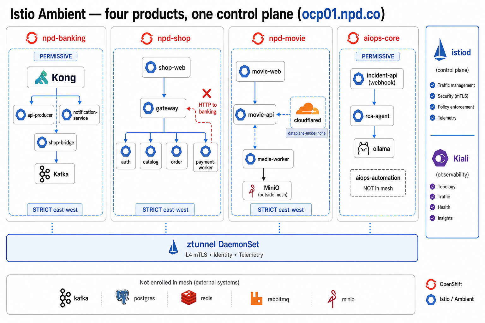

# Istio Ambient — GitOps (cả 4 product)

Control plane **một lần** (repo `banking-demo`). Policy **từng product** (repo tương ứng).

Runbook: [`environments/dev-ocp/INSTALL-ISTIO-AMBIENT.md`](../environments/dev-ocp/INSTALL-ISTIO-AMBIENT.md)



## Đợt B — control plane (banking-demo)

| Path | Việc |
|------|--------|
| `mesh/operator/` | Subscription OSSM 3 + Kiali |
| `mesh/control-plane/` | Namespace + `Istio` ambient + Telemetry/ServiceMonitor (**không** IstioCNI — xem `mesh/bootstrap/`) |
| `mesh/ztunnel/` | PodMonitor ztunnel (**không** ZTunnel CR — bootstrap tay) |
| `mesh/bootstrap/` | **Apply tay:** `IstioCNI` + `ZTunnel` `profile: ambient` |
| `mesh/kiali/` | Kiali CR + Route (**Prometheus = UWM**, không phải platform Thanos) |
| `environments/dev-ocp/argocd/applications/mesh-app-of-apps.yaml` | App of Apps |

```bash
# OVN routingViaHost=true (tay, xem INSTALL)
oc apply -f phase9-gitops-platform/environments/dev-ocp/appproject.yaml -n argocd
oc apply -f phase9-gitops-platform/environments/dev-ocp/argocd/applications/mesh-app-of-apps.yaml
```

**Không enroll cả ns.** Ambient **theo pod**:

| | Ambient | `dataplane-mode=none` (Route / scrape) |
|--|---------|----------------------------------------|
| Banking | auth, account, transfer, notification, api-producer, shop-bridge | frontend, kong-proxy-bridge |
| Shop | gateway, auth, catalog, order, payment | shop-web |
| Movie | movie-api, media-worker | movie-web, cloudflared |
| Kong | — | ns `kong`: `istio-discovery: enabled` (không ambient) — xem `mesh/workloads/kong-namespace.yaml` |
| AIOps | — | không gắn dataplane ns |

**Không enroll:** `kafka`, `postgres`, `redis`, `rabbit`, `minio`, `aiops-automation`, `openshift-*`.

## Kiali graph — không có traffic (Ambient)

Topology có node nhưng **không có mũi tên** = Prometheus **chưa có** `istio_tcp_*` từ ztunnel.

1. UWM bật (`enableUserWorkload: true` — xem `monitoring/DEPLOY.md`).
2. Sync `mesh-control-plane` (Telemetry + istiod ServiceMonitor) và `mesh-ztunnel` (PodMonitor).
3. Kiali trỏ **Thanos Querier** (`openshift-monitoring:9091`) — gộp UWM, không trỏ thẳng `prometheus-user-workload:9092`.
4. RBAC (một lần): `oc adm policy add-cluster-role-to-user cluster-monitoring-view -z kiali-service-account -n kiali`
5. Verify trên bastion:

```bash
# Target scrape ztunnel
oc -n openshift-user-workload-monitoring get prometheus -o yaml | grep -A2 istio-ztunnel || true
# Metric (sau vài phút + có traffic shop)
oc exec -n openshift-user-workload-monitoring prometheus-user-workload-0 -c prometheus -- \
  wget -qO- --header="Authorization: Bearer $(cat /var/run/secrets/kubernetes.io/serviceaccount/token)" \
  'http://localhost:9090/api/v1/query?query=istio_tcp_received_bytes_total{namespace="npd-shop"}' | head -c 500

curl -sk https://npd-shop.co/ >/dev/null
# Kiali → Display → Traffic: Tcp + ZTunnel; time range 15m
```

Chưa có waypoint → chỉ **L4/TCP** trên graph (đủ thấy gateway → auth/catalog/order). HTTP status/latency cần đợt H (waypoint).

## Kiali — Prometheus disabled / 404

**Không** dùng `prometheus-user-workload:9092` trực tiếp (kube-rbac-proxy → 404). Dùng **Thanos Querier**:

```yaml
url: "https://thanos-querier.openshift-monitoring.svc:9091"
health_check_url: "https://thanos-querier.openshift-monitoring.svc:9091/-/healthy"
thanos_proxy:
  enabled: true
```

RBAC: `cluster-monitoring-view` cho SA `kiali-service-account` + `kiali` trong ns `kiali`.

Verify từ cluster:

```bash
TOKEN=$(oc create token kiali-service-account -n kiali)
oc run promtest --rm -i --restart=Never --image=curlimages/curl -n kiali -- \
  curl -sk -H "Authorization: Bearer $TOKEN" \
  "https://thanos-querier.openshift-monitoring.svc:9091/api/v1/query?query=istio_tcp_received_bytes_total{source_workload_namespace=\"npd-shop\"}" | head -c 400
```

## ztunnel.sock NotFound

Xem [`INSTALL-ISTIO-AMBIENT.md`](../environments/dev-ocp/INSTALL-ISTIO-AMBIENT.md) mục **10.1** — `IstioCNI` + `ZTunnel` phải có `profile: ambient`.

## Graph — `unknown` vs dependency thật

Prometheus (UWM) đã xác nhận trên lab:

| `source_workload` | `destination_service` | Ý nghĩa |
|-------------------|----------------------|---------|
| `gateway` | `auth-service`, `catalog-service`, … | East-west mesh — **có tên** |
| `auth-service`, `order-service`, … | `unknown` | Egress **Postgres / Kafka** (ngoài mesh) |
| `shop-web` | `gateway...` | Ingress `none` → BFF |

**ServiceEntry** (`postgres-platform`, `kafka-platform`) đăng ký host cho Istio routing — **không** đổi label `destination_service` trên metric TCP ztunnel (Ambient L4). Node `unknown` bên phải graph = PG/Kafka là bình thường.

| Muốn thấy | Công cụ |
|-----------|---------|
| HTTP status/latency giữa service | **Waypoint** (đợt H) |
| `SELECT`, `kafka produce` | **OTEL** (Grafana/Coroot) |
| Ingress từ Route | `shop-web` = `none` — có thể vẫn `unknown` (cố ý) |

Git: `npd-shop/deploy/mesh/service-entries.yaml`, `banking-demo/mesh/workloads/banking-service-entries.yaml`. **Không enroll** postgres/redis/kafka vào ambient.

## Đợt D — Zero-trust shop

**Git:** repo `npd-shop`, path `deploy/mesh/`. **Argo:** Application `npd-shop-mesh` (sync-wave **4**, sau `npd-shop` wave 3).

| File | Nội dung |
|------|----------|
| `peer-authentication.yaml` | STRICT + PERMISSIVE `shop-web`, `gateway` |
| `authorization.yaml` | deny-all + ALLOW theo SA |
| `service-entries.yaml` | Postgres/Kafka (routing; Kiali L4 vẫn có thể `unknown`) |

**Checkpoint:** UI/API shop OK; exec từ pod `catalog-service` → `auth-service:8001` bị deny; từ `gateway` → `200`. Chi tiết: INSTALL mục **5**.

## Đợt E — Banking + Kong

**Git:** repo `banking-demo` `dev-ocp`, path `phase9-gitops-platform/mesh/workloads/`. **Argo:** Application `mesh-workloads-banking` (sync-wave **5**).

| File | Nội dung |
|------|----------|
| `kong-namespace.yaml` | `istio-discovery: enabled` (Kong **không** ambient — istiod biết pod ns `kong`) |
| `banking-peer-authentication.yaml` | STRICT; PERMISSIVE `frontend`, `api-producer`, `notification-service` |
| `banking-authorization.yaml` | deny-all; ALLOW Kong → `api-producer:8080`, `notification-service:8004` |
| `banking-service-entries.yaml` | Postgres, Redis, Kafka, Kong proxy |

Luồng `/api`: Route → `kong-proxy-bridge` (none) → Kong → `api-producer` (ambient). Kong gửi HTTP thường → cần PERMISSIVE trên `api-producer`/`notification-service`. Authz cần ns `kong` trong discovery + ALLOW L4 port (manifest đã có).

**Checkpoint:** `https://npd-banking.co/` + `/api/auth/health` OK. Chi tiết: INSTALL mục **6**.
## Đợt C–G — từng app (đồng cấp, không chỉ shop)

| Product | Namespace | Repo / path | Identity (SA) | Zero-trust |
|---------|-----------|-------------|---------------|------------|
| **Banking** | `npd-banking` + `kong` | `mesh/workloads/` (wave 5 cùng app-of-apps) | Helm `templates/mesh-serviceaccounts.yaml` | Kong → `api-producer:8080`, `notification-service:8004`. **Không** HTTP từ shop. Frontend Route PERMISSIVE. |
| **Shop** | `npd-shop` | `npd-shop/deploy/mesh/` + `deploy/argocd/npd-shop-mesh.yaml` | Helm `charts/shop/templates/serviceaccounts.yaml` | gateway → auth/catalog/order/payment. **Không** HTTP sang banking. |
| **Movie** | `npd-movie` | `movie-web/deploy/mesh/` + `deploy/argocd/cinehome-mesh.yaml` | Helm `charts/movie/templates/serviceaccounts.yaml` | movie-web → movie-api. **Exclude** cloudflared. |
| **AIOps** | `aiops-core` only | `Open-Source-AIOps-Platform/gitops/mesh/` + Application `aiops-mesh` | incident-api / rca-agent / aiops-console / ollama (đã có SA) | PERMISSIVE webhook. **Không** mesh `aiops-automation`. **Không** gọi API app. |

Shop↔bank = **Kafka**. Movie cô lập. AIOps đọc Prometheus/Coroot.

## Đợt H — waypoint (không auto-sync)

`gitops-platform/applications/mesh/waypoint.yaml` — Application `mesh-waypoint` **không** automated. HTTPRoute weight 0/100 trên `api-producer` (banking) và `order-service` (shop).
